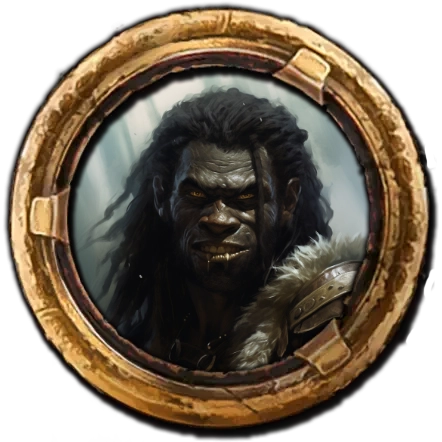

## Das schwarze Auge - 32. Runde der Kampagne: Greifenfurter Adel

Diese Schlacht hat mir einmal mehr die brutale Realität eines Krieges vor Augen geführt. Als Magier bin ich es gewohnt, Probleme mit meinem Verstand und meiner Magie zu lösen, doch auf dem Schlachtfeld zählen oft nur rohe Gewalt und Entschlossenheit. Es ist eine harte Lektion, die ich nicht vergessen werde. Auch wenn wir mit unserem Leben davonkamen, hat uns dieser Angriff der Schwarzpelze viel gekostet und wir müssen davon ausgehen, dass Burg Finster belagert wird. So blieb uns keine Zeit zur Erholung. Wir hatten Verwundete zu versorgen und die Leichen der Schwarzpelze sowie der beiden Oger, die vor den Toren von Burg Finster lagen, mussten beseitigt werden, bevor es zu Krankheiten oder Seuchen kommen konnte. Eine mühsame Aufgabe, an der sich unter der Leitung von Stordian alle beteiligten, die unverletzt geblieben waren oder deren Verletzungen die schwere Arbeit zuließen. Die gefallenen Schwarzpelze wurden mit einem Ochsenkarren zum Fuß des Berges gebracht. So konnten wir auch unsere Ausrüstung mit der der Feinde ergänzen, bevor wir die Überreste verbrannten.

Doch auch anderweitig gab es viel zu tun, daher teilten wir die Arbeit auf. Zuerst galt es, eine gründliche Bestandsaufnahme durchzuführen, und diese fiel nicht gut aus. Die Vorratskammern waren so gut wie leer und die Waffenkammer sah nicht besser aus. Ein Frevel, eine Wehranlage so verkommen zu lassen. Der übermäßige Schmuck und Luxus, in dem der Burgvogt lebte, erweckte einen Verdacht, den Andaryn im Laufe der letzten Tage durch unauffällige Gespräche mit dem Gesinde erhärten konnte.

Die Tatsache, dass der Burgvogt in die eigene Tasche gewirtschaftet hatte, erfüllte mich mit Zorn und Enttäuschung. An der Akademie Schwert und Stab zu Gareth habe ich gelernt, dass Loyalität und Ehre von höchster Bedeutung sind und einen entsprechenden Eid geleistet. Dieser Verrat ist ein Schlag ins Gesicht für alle, die ihr Leben für die Verteidigung dieser Burg riskiert haben. Umso mehr ist es mir eine Genugtuung, dass Andaryn diesen schmierigen Kerl in eine Zelle im Bergfried gesteckt hat.

Durch die Versäumnisse der letzten Jahre und die intensive Schlacht waren die Waffen und Rüstungen von uns und den Soldaten teilweise stark in Mitleidenschaft gezogen. Kalidor und der Schmied aus dem Weiler nahmen sich dieses Problems an und leisteten gute Arbeit, wobei sich Kalidor auf die Ausbesserung der Waffen konzentrierte und der Schmied des Dorfes die Rüstungen reparierte.

In den Abendstunden kümmerten wir uns um das Militärtribunal, das aufgrund der Wachverfehlung eines jungen Soldaten, der Gray in den Rücken geschossen hatte, nötig wurde. Die Entscheidung, den Wachsoldaten anzuklagen und zu bestrafen, fiel mir nicht leicht. Dennoch sah ich es als meine Pflicht an. Als Soldat verstehe ich die Bedeutung von Disziplin und Verantwortung, aber ich weiß auch, dass jeder Mensch Fehler machen kann. Vor allem in einer solch angespannten Situation wie einer Schlacht. Da aber einer seiner Kameraden aussagte, dass der betroffene Soldat seine Pflichten hinsichtlich der Waffenübungen vernachlässigt hätte, musste meiner Ansicht nach ein deutliches Zeichen gesetzt werden. Auf der Burg wurden die militärischen Pflichten scheinbar sträflich vernachlässigt. Daher forderte ich, den Jungen auspeitschen zu lassen. Eine Praxis, die an der Akademie nicht unüblich ist.

In den Tagen vor dem Tribunal übernahmen meine Gefährten, neben ihren anderen Pflichten, auch noch die verantwortungsvolle Aufgabe, die Verteidigung des Delinquenten zu organisieren. So stellte sich recht schnell heraus, dass es sich um den Sohn des Hauptmanns der Wache handelte, was erklärte, warum dieser eine besonders harte Bestrafung gefordert hatte. Ich würde an seiner Stelle ähnlich handeln. Allerdings setzten sich fast alle Kameraden des Beschuldigten vorbehaltlos für diesen ein, was mich ein bisschen an der Aussage, dass er das Training nicht ernst nehmen würde, zweifeln ließ. Da aber ein Urteil gefällt und eine Strafe verhängt werden musste, einigten wir uns nach ausführlicher Beratung auf zwei Monate Dienst ohne Sold und die Verhängung einiger Strafarbeiten. Ich hoffe, dass diese Erfahrung dem Jungen eine Lektion erteilt hat und es nie wieder zu einer Verfehlung mit diesem Ausmaß kommt.

In der Zwischenzeit rotierten die Soldaten zwischen Wache und der Nahrungsbeschaffung, wobei sie anfangs von Link unterstützt wurden. Auch Stordian versuchte sein Glück, blieb aber erfolglos. Weiterhin wurden auch einige sehr vorsichtige Erkundungsmissionen durchgeführt. Bei diesen gelang es uns, drei weitere Lager der Schwarzpelze aufzuklären. Die Größen schätzten wir auf 30, 20 und 10 Mann. Da wir in den Lagern nur Krieger fanden, mussten wir davon ausgehen, dass es noch weitere Lager oder zumindest ein Hauptlager gibt, in dem sich die restlichen Orken befinden.

Von der letzten Erkundung brachte Link einen übel zugerichteten jungen Halbork namens Tuzzugh mit, der vor den Schwarzpelzen geflohen war. Er sprach nur wenige Worte Garethi, daher übersetzten Andaryn und Stordian für ihn aus dem Oloarkh, der Gemeinsprache der Orken, Goblins und Ogern. Tuzzugh berichtete von seinem kleinen Lager mit etwa einem Dutzend Schwarzpelzen und dass er als Halbork von den Orks immer verspottet und misshandelt wurde. Da er befürchten musste, von den allgemein aufgebrachten und häufig schwer berauschten Kriegern eines Tages bei einem Wutausbruch erschlagen zu werden, ist er geflohen. Er wollte sich in eine Siedlung der Menschen absetzen, obwohl er keine rechte Vorstellung davon hat, wie eine solche aussieht, oder was ihn dort erwarten könnte. Tuzzugh konnte uns berichten, dass der Tairach-Priester auf der Suche nach etwas sei und die Sippen der Ausgestoßenen vereint und hierher geführt hat. Er sprach von zwei Symbolen, einem Heptagramm und einem Hexagon. Was diese Symbole bedeuten, wusste er aber nicht.

Wir hingegen sind diesen Symbolen im Verlies unter dem alten Turm schon einmal begegnet und dass die Schwarzpelze danach suchen, beunruhigt mich zutiefst.

Weiterhin berichtete Tuzzugh davon, dass eine menschliche Frau und zwei Kinder im Lager der Orks seinen, und das Lager deswegen gelegentlich von einem Krieger der Menschen, der Beschreibung nach, von einem der Soldaten, Besuch erhielt. Lieder konnte er uns nichts Genaueres darüber erzählen, weil er sich immer möglichst weit von den anderen Orks entfernt hielt. Für uns könnte dies bedeuten, dass wir, auch wenn er vermutlich dazu gezwungen wird, einen Verräter in unseren Reihen haben.
