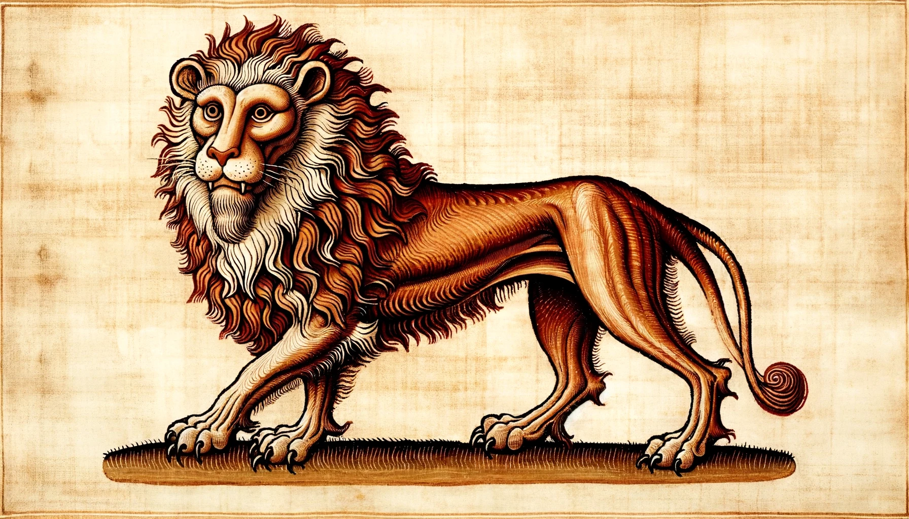

## DSK Session 6 - Aus den Erzählungen von Benjamin Büchernase

Nach unserem Einkauf gönnten wir uns zunächst erst einmal einen Tag Ruhe. Immerhin lebt der kreative Geist von seiner Ausgeglichenheit. Und da es auch dem Körper an nichts fehlen sollte freute ich mich um so mehr über das feine Abendmahl, dass Saytan Wollsammler für uns organisiert hatte. Zwar trübten die drei primitiven Kater am Nachbartisch meine Freude ein wenig, doch wurde ich vom Lächeln einiger hübscher Kätzchen mehr als entschädigt.

Unser Gespräch drehte sich wie üblich um die fünf Murmel und darum, wie es uns gelingen könnte diese zu erlangen. Da wir bislang erst im Besitz einer einzigen roten Glaskugeln waren, hatten wir eine Vielzahl an Möglichkeit uns weiter kundig zu machen und Orte an denen wir suchen konnten. Da wir jedoch schon in der Nacht zuvor bei Grauauge waren und viele von uns Glitzer und Tand erworben hatten, welchen man an die gute Warna Perlenglanz verschenken konnte, empfahl ich, dass wir diesen Plan zu Ende führen sollen bevor wir uns wegen eines andere streiten. Dankeswerterweise scheint auch so langsam etwas von meiner Vernunft auf meine Kameraden abzufärben und so konnten wir uns der Umsetzung unseres Vorhabens widmen.

Warna hat ihr Revier in den Werkstätten, welche in einem recht großen Haus untergebracht waren. Im Erdgeschoss befand sich sogar eine Taverne der Menschen, welche zu unserem Glück aber leer war. Selbst die Wirtin schien heute früh zu Bett zu gehen zu wollen. Glücklicherweise verschwand sie auch recht schnell durch eine Tür und wir hatten Ruhe. Dennoch schlich ich und duckte mich geschickt hinter Tischen und Stühlen. Leider erbrachte meine Suche um Erdgeschoss keine neuen Erkenntnisse und schloss ich mich den anderen auf ihrem Weg ins Obergeschoss an.

Im Obergeschoss stocke uns allen der Atem. Auf dem Bode lag das Fell einer riesigen toten Katze. Oder bessere es Katers, worauf die Mähne schließen ließ. Den schockierten und verwirrten Freunden konnte ich berichten, dass es ich bei diesem prächtigen Exemplar einer Katze um einen sogenannten **Löwvon** handelte. Diese ist der größte Vertreter unserer Art. Allerdings ist mir noch nicht zu Ohren gekommen, dass es unter diesen Großkatzen ebenfalls Erwachte gäbe. Zu gerne hätte ich mein Wissen über unsere großartigen Verwandten mit meinen Freunden geteilt, doch war dies nicht die rechte Zeit und auch nicht der rechte Ort. 

Wenn auch die ein oder andere Wissenslücke an diesem Abend unausgefüllt blieb, so trafen wird doch Warna und vier ihrer fünf Perlen. Handelt es sich um die werten und geschätzten Kater Uno, Dos, Tri und Five. Lediglich Quatre begegneten wir – wie sich letztlich herausstellen wird, zu unserem Glück – nicht. Sie alle waren sehr hilfsbereit und freundlich, doch zu unserem Leidwesen war keiner im Besitz der, so erführen wir, lila Murmel. Warna beschenkte ihre Perlen regelmäßig mit solchen Gaben und die besagte Murmel ging wohl an Quatre.

Wir hatten aber Glück im Unglück. Five, der vor Rubens beeindruckendem Sprung, der ungeschlagene Champion um Wollhimmel war, bot uns an, dass er die Murmel für uns besorgen würde, wenn Ruben ihn in einem Duel der Sprünge schlagen würde. Damit unsere kleiner Ruben nicht allein und mit der ganzen Last der Verantwortung auf seinen Schultern springen musste, erklärten Ravenna und ich uns bereit ebenfalls mit anzutreten. 

So fanden wir uns am nächsten Abend alle im, bis zum Platzen gefüllten, Wollhimmel ein. Wir sprangen in drei Gruppen mit steigendem Schwierigkeitsgrad. Ravenna trat gegen Dos an und ich stellte mich Tri. Ruben trat selbstverständlich gegen Five an, um die größten Kunststücke aufzuführen. Erneut waren uns die Ahnen hold und gemeinsam konnten wir den Wettkampf für uns entscheiden. 

Five war ein Kater der zu seinem Wort stand. Zwar erbat er sich ein wenig Zeit und eine ähnliche Murmel in derselben Farbe, aber tags drauf brachte er uns die lila Murmel. Dies tat er jedoch nicht ohne Worte er Warnung, dass wir uns von Quatre in Acht nehmen sollten. Dies tat er wohl auch zurecht. Am nächsten Morgen wurden wir durch aufgeregtes Geplapper und Gerufe der Katzen des Dorfes geweckt.

Auf dem Dach eines Hauses stand Quatre, der einen mächtig mitgenommenen Five am Kragen hatte und ihn beschimpfte und beschuldigte. Dann tat er das unaussprechliche um ermordete seinen Kameraden. Es war eine furchtbare Tragödie und es wurde noch schlimmer. Der Grund für diese Grausamkeit war die lila Murmel, die wir von Five erhalten hatten und Quatre wollte sie zurück.

Wo sind wir da nur hineingeraten?
