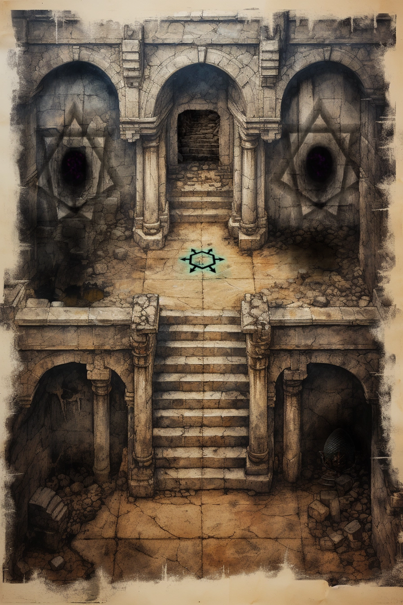
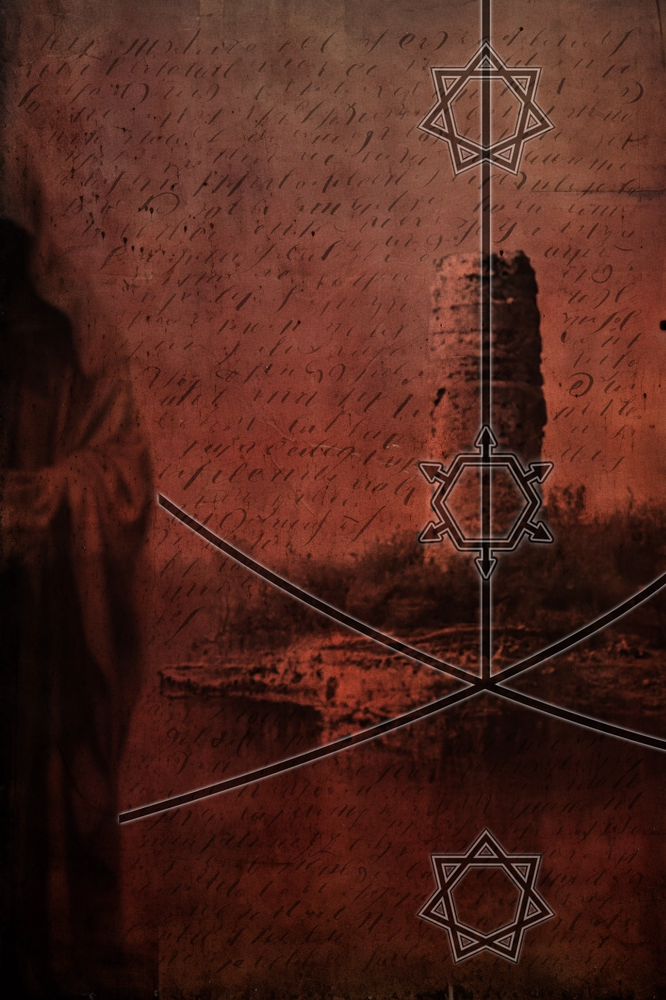
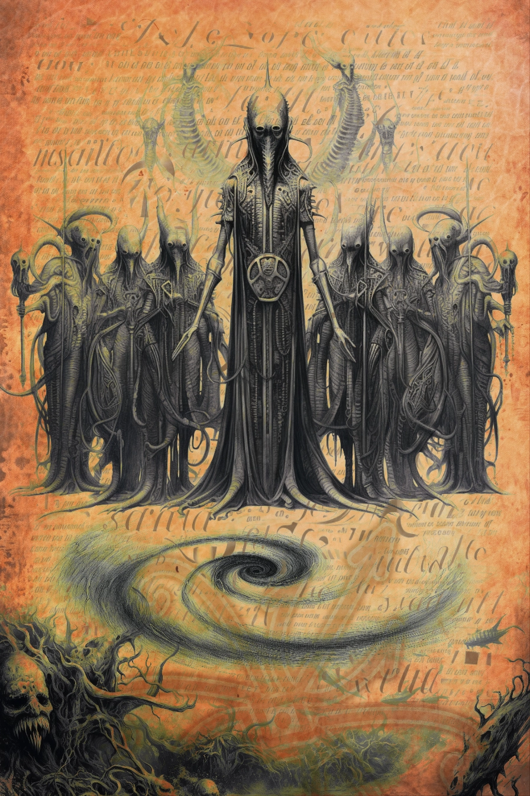
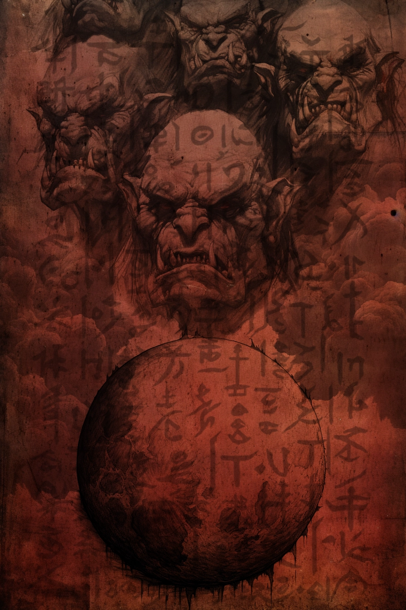
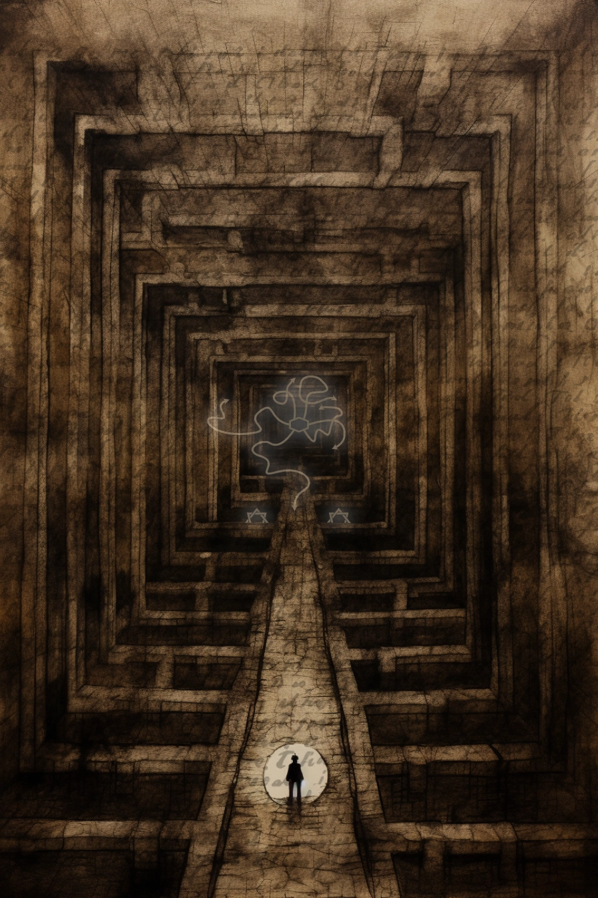
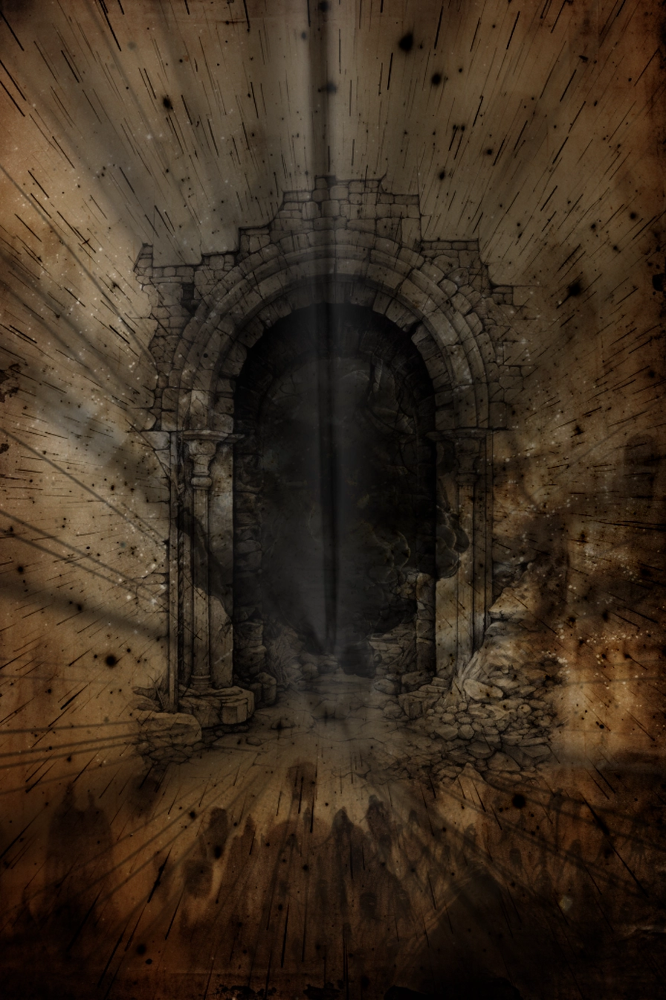
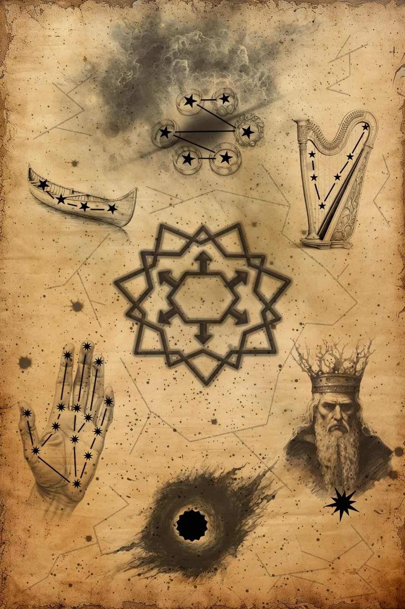

## Das schwarze Auge - 36. Runde der Kampagne: Greifenfurter Adel

In der alten Mine mussten wir uns noch härteren Gegnern stellen. Angesichts der Wunden aus unserem letzten Kampf fiel uns dies nicht leicht, doch die Zwölfe standen auf unserer Seite und wir konnten die Schwarzpelze zurückdrängen.

Hierbei kam uns zugute, dass sich einige der orkischen Sklaven gegen ihre Bewacher auflehnten. Dieser Umstand ermöglichte es uns, weiter in die Mine vorzudringen, um nach dem orkischen Priester oder Schamanen zu suchen.

Wir kämpften uns bis zu einer zentralen Kammer durch, in der die Decke ein wenig eingebrochen war, was etwas Licht spendete. Es war diese Kammer, in der wir auch den Altar fanden.

Andaryn und ich begutachteten gerade die grausigen Relikte, als ein Oger aus der Tiefe eines dunklen Ganges kam. Tapfer stellte sich Andaryn diesem Ungeheuer entgegen, um uns anderen Zeit für einen Rückzug zu erkaufen. Ihr Mut ermöglichte mir, diese Chance zu nutzen, und ich griff einige Schriftrollen vom Altar und rief meine Kameraden zum Rückzug.

Dank unserer gemeinsamen Kampferfahrung gelang es uns, diesen Rückzug geordnet anzutreten. Auf dem Weg nach draußen schloss sich uns einer der menschlichen Sklaven, auf den ersten Blick vermutlich ein Tulamide, an. Auch er hatte tapfer gegen die Orks gekämpft und so war ich froh, ihn an unserer Seite zu wissen.

Gemeinsam mit Gray trug ich Link, der bei seinem heldenhaften Versuch, Stordian zu unterstützen, schwer verwundet wurde. Als Andaryn und Storidan, die die Nachhut bildeten, zu uns stießen, sahen wir zu, dass wir von diesem unsäglichen Ort verschwanden und ohne Pause zurück zur Burg Finster ritten.

Mit letzter Kraft kamen wir nach einem langen Ritt dort an, versorgten unsere Wunden, aßen und tranken ein wenig und legten uns erst einmal zur Ruhe. Zwei Tage dauerte es, bis wir wieder halbwegs auf den Beinen waren und wir nutzten die Zeit, um ein wenig über und von unserem neuen Begleiter zu erfahren. Er nannte sich Zayn Bassam und stammte aus den Tulamidenlanden, genauer gesagt aus Khunchom.

Zayn konnte uns berichten, dass der Schamane schon vor zwei Tagen mit einem Trupp seiner Krieger aufgebrochen war und seitdem nicht zurückgekehrt ist. Außerdem soll es noch vier weitere menschliche und gut ein Dutzend orkische Sklaven gegeben haben.

Es war uns klar, dass es in unserer Verantwortung liegt, diesen versklavten Menschen zu helfen. Doch wir waren uns auch schmerzlich bewusst, dass wir ohne die erwartete Verstärkung keine Chance hatten. So mussten wir uns schweren Herzens zurücknehmen und abwarten.

So widmenden wir unsere Aufmerksamkeit den Schriftrollen, die wir in der Mine gefunden hatten und studieren sie gemeinsam. Hierbei kamen wir zu den nachfolgend geschilderten Ergebnissen.

## Rolle des Eises

Die Schriftrolle ist von einer kühlen Eleganz, die durch die seltenen und wertvollen blauen Tinten hervorgerufen wird, mit welchen Text und Darstellung ausgearbeitet wurden. Das Pergament ist sehr hochwertig und bis auf kleine Risse an den Kanten gut erhalten. Die Zeichnung selbst scheint an einigen Stellen absichtlich verblasst, um den nebelhaften Figuren, die aus dem eisigen Hintergrund hervortreten, mehr Ausdruck zu verleihen.

Bei oberflächlicher Betrachtung präsentiert die Rolle drei sorgfältig gezeichnete Eissterne oder Frostblumen, deren kristalline Strukturen das Licht einfangen und reflektieren, als wären sie aus gefrorenem Himmel geschnitten. Doch eine tiefere Analyse enthüllt das wahre Genie dieser Kreation: Ein Hexagon, gefasst von zwei Heptagrammen, zeugt von einer verborgenen Ordnung und Symmetrie, die in der eisigen Tiefe der Rolle eingebettet liegt. In einer Schlucht, so tief, dass weder Sonnen- noch Mondlicht auf ihren Grund scheinen, wachen zwei gespenstische Hüter aus Raureif. Über ihnen dargestellt ist ein Schwert, umgeben von einer Aura der Ehre, welche aus längst vergangenem Schlachten herrührt. Ein Text in unbekannten Lettern erstrecket sich zwischen den eisigen Rändern der Schlucht, eine geheime Botschaft, die nur jene entschlüsseln können, die der fremden Sprachen mächtig sind.

Je länger man die Darstellung betrachtet, desto lebendiger werden die nebelhaften Figuren, bis man glauben könnte, dass es Totengeister sind, die einen direkt in die Seele schauen. Ihre blassen Augen sind gefüllt mit der Weisheit und dem Leid unzähliger Jahrhunderte. Die massiven Wände der Eisschlucht ragen immer bedrohlicher empor, als könnten sie jeden Moment einstürzen und alles unter sich begraben. Ein längerer Blick auf die Zeichnung lässt einem die Kälte bis in die Knochen spüren, ein Frösteln, das tiefer geht als die bloße physische Empfindung – es ist, als ob die Rolle eine Brücke schlägt zu einer Welt, in der der Frost herrscht und das Schwert der Ehre von legendärer Bedeutung ist.

### Erkenntnisse der Magiekunde
Die transparenten Gestalten aus Raureif könnten als visuelle Manifestation von Elementargeistern des Eises interpretiert werden, was auf eine intensive Präsenz und möglicherweise auch auf einen Ort hinweist, der stark von ewiger Kälte durchdrungen ist.

Die Darstellung der Geister oder Elementare, eingerahmt von den eisigen Wänden, legt eine Verbindung zur Schlucht der Madalosen Nacht nahe, die sich im Ehrnen Schwert befindet.

Das Hexagon, mit den nach außen weißenden Pfeilen an jeder Kante, könnte ein Wegweiser zu verborgenen Heiligtümern oder Orten großer Macht darstellen, die in den tiefen Eisschluchten versteckt sind.

### Erkenntnisse der Geographie
Die eisigen Formationen auf der Schriftrolle sind charakteristisch für die raue, unerbittliche Landschaft des hohen Nordens Aventuriens, weit entfernt von den milderen klimatischen Bedingungen der zentralen Regionen.

Die Darstellung könnte die Schlucht der Madalosen Nacht im Ehrnen Schwert repräsentieren, eine Region, die für ihre undurchdringliche Dunkelheit und tiefen Klamm bekannt ist, durch die der Fluss Nagrach fließt.

### Weitere Erkenntnisse
Stordian vermutet, dass die Schriftrolle den Weg zu einem mächtigen, vielleicht sogar magischen Schwert weißt.

## Rolle des Verlieses

Die kunstvolle Gestaltung der Schriftrolle ist ein wahres Meisterwerk. Jeder Strich, jede Linie und jedes Detail wurde mit größter Präzision ausgeführt. Die Farben wurden sorgfältig ausgewählt und das Blau leuchtet, als ob es gerade erst aufgetragen wurde. Die Präzision, mit der die Schriftrolle bearbeitet wurde, ist beeindruckend. Jeder Linie ist perfekt geformt, jede Verzierung exakt platziert. Es ist, als ob der Künstler eine unfehlbare Hand hatte, die jeden Strich mit einer unglaublichen Genauigkeit setzte. Man kann sich nur vorstellen, wie viel Zeit und Mühe in die Herstellung dieses Werks investiert wurden. Auch der Zustand der Schriftrolle ist bemerkenswert. Keine Spur von Alter oder Abnutzung ist zu erkennen. Es ist, als wäre sie gerade erst erschaffen worden, frisch und unberührt.

Die Darstellung stellt den Betrachter inmitten eines verfallen Verlieses, dessen Wände und Nischen von Geheimnissen zu erzählen scheinen. Hierbei steht der Zustand des dargestellten Gewölbes in Gegensatz zum Zustand der Schriftrolle.

Das Zentrum der Darstellung wird von einem Hexagon beherrscht, das strategisch platziert zu sein scheint, um vielleicht Ausgang oder Ziel des Verlieses zu markieren. Von jeder seiner Seitenflächen weist ein Pfeil nach außen, als ob sie den Weg aus der Dunkelheit oder tiefer hinein weisen. Dieses Sechseck ist nicht einfach nur ein Teil des Verlieses, es scheint dessen Herzstück zu sein, der Schlüssel zu einem Rätsel, das sich in den umgebenden Mauern verbirgt.

Neben dem Sechseck nehmen die Heptagramme ihren Platz ein. Sie sind wie Tore angeordnet, die einen nicht nur physisch, sondern auch geistig in die Dunkelheit zu führen drohen. Ihre Positionierung im Verlies gibt dem Betrachter das Gefühl, vor einer Schwelle zu stehen, die sowohl einladend als auch bedrohlich wirkt.

Das gesamte Kunstwerk ist durchdrungen von einer obsessiven Liebe zum Detail, die sowohl die Virtuosität des Künstlers als auch seine mögliche geistige Verfallenheit offenbart. Die Darstellung auf dem Pergament ist so intensiv, dass es den Betrachter in seinen Bann zieht und ihn Teil dieser gefährlich detaillierten Welt werden lässt. Es ist, als ob jede Linie, jede Schattierung dazu beiträgt, das Verlies zum Leben zu erwecken und es in den Raum hinein auszudehnen, in dem die Schriftrolle entrollt wird.

### Erkenntnisse der Sagen & Legenden
Das Verlies, festgehalten auf der Schriftrolle, wirkt wie ein aus der Zeit gefallenes Relikt. Es erinnert an Legenden alter Zivilisationen, die solche Bauwerke als Schwellen zu anderen Welten oder als Orte der Bewahrung verbotenen Wissens erschufen. Die makellose Erhaltung der Schriftrolle kontrastiert mit dem Verfall des dargestellten Gewölbes und deutet auf einen zeitlosen Ursprung oder eine magische Konservierung hin.

Die zentrale Platzierung des Hexagons könnte in alten Mythen auf das Herzstück eines verschlungenen Rätsels hinweisen, dessen Lösung den Zugang zu verborgenen Kammern oder verstecktem Wissen eröffnen könnte. Die nach außen weisenden Pfeile verstärken den Eindruck eines Schlüssels oder eines Wegweisers.

### Erkenntnisse der Magiekunde
Die präzise und intakte Darstellung des Hexagons im Zentrum des Verlieses suggeriert eine magische Absicht hinter seiner Platzierung. Die Heptagramme, die oft mit mystischer Symbolik in Verbindung gebracht werden, könnten hier als magische Siegel fungieren, die darauf abzielen, die Energien des Verlieses zu binden oder zu lenken. Auch das strahlende Blau und die makellose Erhaltung der Schriftrolle könnten durch eine magische Behandlung bedingt sein, die darauf abzielt, die Schriftrolle über die Zeiten hinweg zu bewahren. Das Gefühl des Hineingezogenwerdens in das Kunstwerk entsteht alleine durch die Darstellung und das künstlerische Talent des Schöpfers.

Die Tatsache, dass die Symbole in einem sonst verfallenen Verlies so präzise dargestellt sind, könnte darauf hindeuten, dass sie einen wichtigen Schlüssel zur Entschlüsselung des dargestellten Ortes darstellen.

Das zentrale Hexagon, mit den nach außen weißenden Pfeilen an jeder Kante und in Kombination mit den Heptagrammen lässt auf eine magische Bedeutung schließen. Die Art und Weise der Darstellung im Verlies lässt einen Weg- oder Zugangspunkt vermuten.

### Weitere Erkenntnisse
Link entdeckte in der Darstellung ein schuppiges Ei, welches auf einem Sockel im Verlies ruhte. Er vermutete, dass es sich bei dieser Darstellung um ein Drachenei handeln muss. Dies könnte ein Hinweis auf das *Magische Institut und Lehranstalt vom Ei des Drachen zu Yash'Hualay, wiedererrichtet von Tuleyman ibn Dunchaban zur Erforschung von Magie und Materie* sein. Vielleicht ein Zufall, aber dies könnte zu dem in Tulamidya verfassten Schuldschein passen, den wir in der Höhle unter dem alten Turm gefunden hatten. Diese sprach von einer Bezahlung in Alastren, welche in der Drachei Akademie geprägt werden.

## Rolle der Ruine

Diese Schriftrolle, geschätzt auf ein halbes Jahrtausend an Jahren, ist sorgfältig auf Haut gezeichnet, deren Farbton das Blutrot vergangener Tage bewahrt, nun überzogen mit einer bräunlichen Patina der Alterung. Der Text und die Abbildung einer Ruine sind über die Jahre verblasst, doch immer noch sichtbar, ein stummes Zeugnis der Geschichte, die sie erzählen. Im Gegensatz dazu stehen die Linien, das zentrale Hexagon und die umgebenden Heptagramme, deren Kanten trotz des Alters scharf und deutlich bleiben, fast so, als wären sie immun gegen die Erosion der Zeit.

Rechtsseitig auf der Rolle ziehen sich zwei sich kreuzende Linien zum Fundament der Ruine, von deren Schnittpunkt eine Linie streng nach oben führt, als würde sie eine Verbindung zwischen Erde und Himmel oder Vergangenheit und Zukunft symbolisieren. Ober- und unterhalb der Turmruine sind die Heptagramme platziert, als Wächter oder vielleicht als Zeichen eines höheren Zwecks. Das Hexagon, in perfekter Harmonie mit der orthogonalen Linie, liegt direkt auf der Darstellung des Turms und fügt sich nahtlos in das Bild ein. Links erscheint die Andeutung einer Gestalt in einer Kutte oder einem Umhang, deren Konturen in den Hintergrund verschwimmen und die Interpretation dem Betrachter überlassen. Die gesamte Rolle ist mit Texten in einer nicht mehr zu entziffernden Schrift bedeckt, die das Gefühl von Geheimnis und verschollener Weisheit vermitteln.

Der mysteriösen Texte, der sich über die gesamte Oberfläche der Schriftrolle erstreckt, bleibt ein Rätsel. Seine Buchstaben sind in einer geheimen Sprache verfasst, die ebenso alt wie die Ruine selbst zu sein scheint, und deren Bedeutung sich nur im Flüstern der Legenden erhalten hat. Die Gestalt in der Kutte, die in die linke Seite der Schriftrolle eingebettet ist, wacht über dieses Geheimnis mit einer Präsenz, die fast spürbar ist. Die Schärfe der Heptagramme und des Hexagons kontrastiert mit der verblassten Darstellung der Ruine und des Textes, was darauf hindeuten könnte, dass sie zu einem späteren Zeitpunkt hinzugefügt wurden – vielleicht als Schlüssel zu dem Rätsel, das die Ruine birgt. Die Kreuzung der Linien und die aufsteigende orthogonale Linie könnten einen Ort von Bedeutung markieren, einen verborgenen Punkt der Kraft oder des Übergangs, der die Ruine einst mit Energie versorgte und dies vielleicht auch noch immer tut.

### Erkenntnisse der Sagen & Legenden
Die Ruine, festgehalten auf dieser Schriftrolle, könnte einst ein strategischer Verteidigungspunkt oder ein alter Magierturm gewesen sein, um den sich nun Mythen ranken, die von unterirdischen Schatzkammern und alten Mächten flüstern, die dort verborgen liegen sollen. Die Darstellung ähnelt stark dem "Finsterturm", einem mysteriösen Ort östlich des Finsterkamms, bekannt durch Sagen, die ihn als einen Ort beschreiben, der mit undurchsichtigen Geheimnissen und einer bedrückenden Vergangenheit behaftet ist.

### Erkenntnisse bezüglich Götter & Kulte
Die Abbildung auf der Schriftrolle könnte eine Stätte von kultischer Bedeutung darstellen oder zumindest einen Teil davon. Vermutlich ein zentraler Ort für Rituale und Verehrungen. Die verschwommene Gestalt in der Robe deutet auf einen Anhänger oder vielleicht einen Wächter des Kultes hin.

Die Abwesenheit erkennbarer Symbole göttlicher oder dämonischer Mächte verleiht der Darstellung eine beunruhigende Neutralität. Dieses Fehlen konkreter Hinweise wirft zahlreiche Fragen auf, insbesondere nach der Natur der dort praktizierten Verehrung.

### Erkenntnisse der Magiekunde
Die auf dieser Schriftrolle verewigten Symbole und Linien sind eindeutig von magischer Provenienz, was darauf hindeutet, dass sie in magischen Praktiken eingebunden waren oder eine spezifische arkane Funktion erfüllten.

Obgleich die Symbole und Linien mit großer Sorgfalt einheitlich gezeichnet wurden, scheint ihr Zusammenspiel disharmonisch – ein Hinweis darauf, dass sie aus verschiedenen magischen Kontexten zusammengesetzt sein könnten.

Die mysteriösen Symbole, deren magische Natur unverkennbar ist, entziehen sich jeder bekannten Kategorisierung. Ihre Bedeutung muss von großer Tragweite sein und könnte Schlüssel zu verborgenen arkanen Geheimnissen enthalten.

### Erkenntnisse der Kriegskunst
In der Kriegskunst diente die Positionierung solcher Türme strategisch der Überwachung und Sicherung von wichtigen Punkten wie Passwegen oder Grenzlinien. Ihre robuste Konstruktion war darauf ausgelegt, Belagerungen zu widerstehen und als letzter Rückzugspunkt zu dienen.

## Rolle der Wächterhaut

Diese Schriftrolle ist eine Tätowierung auf menschlicher Haut, die ein Leben lang Wind und Wetter ausgesetzt war – eine Leinwand, die vielleicht einst einem Seefahrer gehörte. Eingraviert in die Haut sind seltsame Kreaturen, deren bloßer Anblick genügt, um den Betrachter zu verwirren. Ihre Gesichter sind ein Rätsel: mit außerweltlichen Zügen und Augen, die an die Abgründe des Ozeans erinnern – oder sind es vielleicht doch nur Masken? Ihre Gewänder, wirken seltsam und faltig, man könnte vermuten, dass sich Tentakeln darunter verbergen und sich an manchen Stellen daraus hervorwinden.

Starr und undurchdringlich wie Wächter positionieren sich diese Figuren um einen Sog, der entweder in die Tiefen des Meeres oder in die Unendlichkeit zu führen scheint. Ihre Präsenz wirkt ruhig und abwartend, doch ein Zweifel bleibt, was ihr wahrer Zweck sein mag. In der unteren rechten Ecke der Darstellung lässt sich gerade noch die Silhouette von Efferds Dreizack erkennen, obwohl dieser Teil der Tätowierung schon stark verblasst ist

Diese ganze Szenerie ist umgeben von Text in einer fremden und vermutlich sehr alten Schrift, die wie ein Netz über das Bild gespannt ist. Die Schriftzeichen flüstern von einer Zeit, die längst vergangen ist, und bergen Geheimnisse, die tief im Ungewissen wurzeln. Sie umrahmen die Tätowierung und verleihen ihr eine Aura des Mystischen, als wären sie der Schlüssel zu einer Welt, die jenseits unseres Verständnisses liegt.

### Erkenntnisse der Sagen & Legenden
Die auf der Haut tätowierten Gestalten erscheinen wie Wächter oder eine Garde, uniformiert und mit einer deutlichen Verbindung zum Meer. Ihre Präsenz und das maritime Thema lassen auf mysteriöse Aspekte des Meeres schließen, die dem Menschen unbekannt oder unverständlich sind.

### Erkenntnisse bezüglich Götter & Kulte
Das Symbol des Efferd auf der alten Haut wirft Fragen auf. Es scheint eine ältere, stark verblasste Tätowierung zu sein, aber irgendetwas daran wirkt ungewöhnlich oder fehl am Platz.

Der Dreizack des Efferd ist zwar erkennbar, aber es sieht aus, als ob sich die Krake der Charyptoroth in einer Tarnung präsentiert, die die Spitze des Dreizacks bildet. Eine solche Darstellung könnte auf eine Vermischung oder Verflechtung der Symbole beider Entitäten hindeuten.

## Rolle des Blutgottes

Gefertigt aus der Haut eines Sklaven, entfaltet sich die Schriftrolle als ein Dokument, das zwar nicht Jahrhunderte, sondern nur Jahrzehnte überdauert hat. Die makabre Herkunft des Materials ist bezeichnend für diejenigen, die sie in Händen hielten – die Orks, deren rauer Umgang mit heiligen Gegenständen ebenso roh ist wie ihre Sitten. Die Haut ist stellenweise abgenutzt, an einigen Stellen rissig und mit Flecken übersät, die von blutigen Ritualen und der rauen Behandlung ihrer Besitzer zeugen. Die Schriftrolle ist robust, doch die Spuren ihres Gebrauchs sind unverkennbar, und man kann erahnen, dass sie Zeuge von dunklen Zeremonien und barbarischen Festen war.

Das zentrale Element der Darstellung ist eine rote Mondscheibe, in der unteren Hälfte der Darstellung, die mit einem unheilvollen Glühen den Betrachter fixiert. Sie dominiert die Szenerie, die von der Endlosen Nacht des Blutenden Mondes zu erzählen scheint. Der Himmel selbst scheint von einem unendlichen Blutschleier überzogen, der die Welt in eine ewige Dämmerung taucht. Oberhalb der Mondscheibe findet man die Abbildungen von düstern Schwarzpelzen – grausamen Kriegern und finsteren Schamanen, die in ihren archaischen Rüstungen und mit Ritualgegenständen ausgestattet, durch ihre pure Erscheinung Furcht und Schrecken verbreiten. Ihre Gesichter sind von einer erbarmungslosen Aggression gezeichnet, die nur im Kampf und durch Blutvergießen gestillt werden kann. Runen, die entfernt an eine orkische Ursprache erinnern, durchziehen die Szene und scheinen die Darstellung sowohl zu erzählen als auch zu beschwören.

Die Krieger und Schamanen auf der Schriftrolle wirken wie Geister von Verstorbenen, ehrbare Kämpfer, deren Pflicht selbst im Tode unvollendet bleibt. Sie stehen wie Wächter einer Schwelle zwischen den Welten. Hüter einer Wahrheit, deren Augen leere Abgründe sind, aus denen noch immer die Glut des Kampfes lodert. Ihre Gestalten sind eingehüllt in die Schatten des Unheils, des Todes, des Leids, der Qual und der Folter – jedes Bild ein Echo der Grausamkeiten, die sie im Leben vollbracht haben und im Tode weiterführen. Die rote Mondscheibe thront unter ihnen, ein unmissverständliches Zeichen des Blutgottes, dessen lebendige Kraft aus jeder Faser der Schriftrolle zu pulsieren scheint. Sie ist nicht nur ein Symbol der Macht, sondern auch ein Portal, durch das die unermüdliche Energie eines Gottes fließt – ein dunkles Herz, das in der Brust der Orks und ihrer Schamanen schlägt und sie antreibt, in einem endlosen Zyklus des Blutvergießens und der Zerstörung.

### Erkenntnisse bezüglich Götter & Kulte
Die rote Mondscheibe auf der Schriftrolle symbolisiert Tairach, eine Gottheit, die von den Orks verehrt wird und oft als Blutgott bezeichnet wird. Sein Aspekt ist mit Blut, Erinnerung und Tod verbunden und wird in Zusammenhang mit dem Mond und der Zeit gebracht, was auf eine tiefe Verwurzelung in den Glaubenssystemen der Orks hinweist​​. Die Darstellung der Schwarzpelze und die omnipräsenten Runen könnten auf die Verehrung von Tairach als Wächter des Nicht-Lebens und Herr über die Geister hinweisen. Dies deutet auf die Bedeutung von Tairach als Totengott hin, was sich in den rituellen Praktiken und dem schamanischen Aspekt seiner Anhänger widerspiegelt​​.

Die Abbildungen der Krieger und Schamanen, die wie Geister erscheinen, könnten als Hüter zwischen den Welten interpretiert werden, die in den Glaubenssystemen der Orks eine wichtige Rolle spielen. Ihre Darstellung reflektiert möglicherweise den Glauben an eine Wiederkehr und an die Kontinuität des Kampfes auch nach dem Tod​​.

### Erkenntnisse der Sternenkunde
Die Darstellung der roten Mondscheibe auf der Schriftrolle wird als Symbol des Blutgottes Tairach identifiziert. Dieses Zeichen wird oft mit dem Blutmond in Verbindung gebracht, einer seltenen Himmelserscheinung, die in vielen Kulturen als Omen für Unheil und Blutvergießen gilt.

## Rolle des Labyrinths

Das Ziegenleder, ein Meisterstück alter Handwerkskunst, dessen Oberfläche die Zeiten überdauert hat, zeigt sich als ein Zeugnis alten Wissens. Es strahlt Beständigkeit aus und wirkt trotz der leichten Zerschlissenheit an den Rändern – den stummen Zeugen einer langen Reise – robust. Der Kern der Schriftrolle, mit der Darstellung eines Labyrinths ist bemerkenswert gut erhalten, fast als ob er die unzähligen Blicke, die über ihn geglitten sind, willkommen heißt, ja sogar anzieht.

Im Zentrum des Labyrinths entfaltet sich ein zentraler Weg, ein gerader Pfad, ein unermesslicher Weg, der sich scheinbar bis in die Unendlichkeit erstreckt. Um diesen Hauptweg herum entfaltet sich ein Netz aus Pfaden, die wie von einem labyrinthischen Wahnsinn gezeichnet scheinen. Diese Pfade erstrecken sich entlang aller Ebenen an den Wänden und der Decke. So bleibt es unklar, ob der zentrale Weg hinein, heraus, hinab oder hinauf führt.

Die beiden Heptagramme, die ihn in der Tiefe der Darstellung flankieren, dienen nicht nur als Hinweise innerhalb des Labyrinths, sondern als Fixpunkte im Chaos, als mystische Wegmarken, die den einsamen Wanderer locken und zugleich verspotten.

Inmitten des Labyrinths befindet sich ein Hexagon, von dem Pfeile ausgehen, die sich entlang verschlungener Pfade winden. Sie erschaffen eine Illusion der Bewegung für diejenigen, die den Blick zu lange darauf ruhen lassen, als würden sie sich lebendig durch das Labyrinth schlängeln und den Betrachter tiefer in das Rätsel hineinziehen. Verliert man sich in der Darstellung des Labyrinths, scheint es, als würden sie sich bewegen.

Auch der Lichtkegel des einsamen Wanderers, auf seinem Weg durch die Unendlichkeit der Möglichkeiten, beginnt scheinbar zu unruhig flackern und zu tanzen und auch er selbst schein unermüdlich auf seinem Weg voranzuschreiten. Es entsteht der Eindruck einer Unruhe oder Rastlosigkeit, wie sie nur aus einer tiefen Verzweiflung entstehen kann. Die Heptagramme, die stets eine konstante Entfernung zum Wanderer beibehalten und so immer außer Reichweite blieben, tragen zu diesem Gefühl bei. Doch getrieben von seinem Wahn schreitet der Wanderer stets voran.

Es ist eine Reise ohne Bestimmungsort, ein endloses Streben nach Erleuchtung inmitten der Schatten, die das Labyrinth wirft. Die Schriftrolle lädt dazu ein, diesem Wanderer auf einem Weg zu folgen, der sich stets verändert und nie endet – eine metaphysische Wanderung durch die Unendlichkeit, bei der jede Wendung und jeder neue Korridor nur die Gewissheit verstärkt, dass es keine Rückkehr gibt, nur den Weg vorwärts, tiefer hinein in die unergründlichen Tiefen des Labyrinths und des eigenen Geistes.

Betrachtet man die Darstellung zu lange, scheint es als ob man vom Wahnsinn des Wanderers ansteckt wird. Obwohl man niemals eine Veränderung beobachten kann, zeigt jeder neue Blick auf das Labyrinth neue Wege, Pfade und Sackgassen. Es fällt immer schwerer sich von der Darstellung loszureißen, da man sich der Lösung des Rätzels nahe wähnt.

### Erkenntnisse der Sagen & Legenden
Die Schriftrolle scheint eine Warnung zu verkörpern: Sie symbolisiert den Verlust des Verstandes, der eintritt, wenn man einem ziellosen Weg folgt und sich mit Rätseln beschäftigt, die für Sterbliche nicht bestimmt sind.

Es gibt Hinweise auf die mysteriösen und rätselhaften Strukturen, die auf den Zyklopeninseln vermutet werden. Diese könnten in Verbindung mit dem Labyrinth der Schriftrolle stehen.

### Erkenntnisse des Geschichtswissen

Heute nutzt man Labyrinthe hauptsächlich zum Lustwandeln. In der Antike waren sie jedoch nicht für Unterhaltungszwecke gedacht, sondern dienten als Schutz für wichtige Strukturen wie Gräber und Mausoleen. Ihre Komplexität und Verwirrung sollten ungebetene Gäste fernhalten. Neben den verwirrenden Pfaden waren Labyrinthe oft mit tödlichen Fallen ausgestattet, um den Schutz weiter zu verstärken und Eindringlinge abzuschrecken.

In historischen Berichten werden Labyrinthe manchmal als Orte des Wahnsinns beschrieben, wo die ständige Konfrontation mit unauflösbaren Wegen und Sackgassen den Verstand der Eingeschlossenen auf die Probe stellte. Der Ursprung vieler Labyrinth-Geschichten liegt oft in der Überlieferung, dass diejenigen, die sich in den Tiefen solcher Anlagen verirrten, selten zurückkehrten, was den Mythos von Labyrinthen als unheimliche Orte des Wahnsinns und der Verzweiflung nährte. Einige Labyrinthe waren angeblich so komplex gestaltet, dass man annahm, sie existierten teilweise jenseits der materiellen Ebene. Diese Vorstellung führt jedoch schnell in den Bereich der Mythen und Legenden.

### Erkenntnisse der Magiekunde

Das Labyrinth könnte als metaphysischer Schutz konzipiert worden sein, der dazu bestimmt ist, Wissen oder magische Geheimnisse zu bewahren. Die verschlungenen Pfade repräsentieren möglicherweise komplexe magische Formeln oder Zaubersprüche, die nur von Eingeweihten entziffert werden können.

Die Einbeziehung der Heptagramme zusammen mit dem Hexagon in der Darstellung des Labyrinths lässt auf eine ausgeklügelte magische Struktur schließen, deren Komplexität möglicherweise eine höhere magische Ordnung und tiefere Geheimnisse andeutet.

Das Hexagon im Zentrum könnte als ein Wegweiser innerhalb des Labyrinths fungieren, der vielleicht nicht nur einen, sondern mehrere Pfade aufzeigt. Es könnte ein Schlüssel zu geheimem Wissen sein oder zu versteckten Orten führen.

## Rolle des Schattentores

Das Pergament zeigt eine Braunfärbung, die an die Seiten eines alten, viel gelesenen Buches erinnert. Über die Jahre hat es an manchen Stellen Flecken angesammelt, die sich in das Material eingebettet haben und es stellenweise schwierig machen, die ursprünglichen Zeichnungen von den Markierungen der Zeit zu unterscheiden. Die Tinte der Zeichnungen ist dunkel und deutlich, trotzt den Jahren und hebt sich stolz vom Hintergrund ab. Sie hat eine bemerkenswerte Tiefe bewahrt und zieht klare, entschlossene Linien über das Pergament, das die Hände vieler Generationen überdauert hat.

Auf dem Pergament breitet sich eine Abbildung aus, die Raum für Interpretationen lässt – ein Bauwerk, das sich als Pforte, Torbogen, Durchgang oder eine andere Art von Schwelle präsentiert. Dieses Motiv steht geheimnisvoll im Mittelpunkt, umgeben von einem Nimbus der Rätselhaftigkeit, als ob es ein Tor zu einem unbekannten Ziel wäre.

Aus dieser undurchdringlichen Öffnung emporragend, zeichnet sich ein senkrechter Strahl ab, der eher Dunkelheit als Licht verbreitet und somit den Pfad, der sich dahinter erstreckt, in Schatten hüllt. Dieser Strahl vermittelt den Eindruck eines leitenden, aber zugleich warnenden Zeichens, das den Betrachter in eine tiefere, fast mystische Dimension des Unbekannten führt.

Die Art und Weise, wie der Strahl das Bauwerk überlagert, lässt die Grenzen zwischen dem Realen und dem Übernatürlichen verschwimmen. Es scheint, als ob der Strahl eine verborgene Botschaft oder ein Geheimnis birgt, das nur denen offenbart wird, die den Mut haben, den Pfad zu beschreiten. Die Darstellung spielt mit Licht und Schatten, erzeugt eine Atmosphäre der Unbestimmtheit und des Geheimnisvollen und lädt dazu ein, über die verborgenen Bedeutungen und die möglichen Geschichten, die sich hinter diesem geheimnisvollen Bauwerk verbergen, zu spekulieren.

Entlang der Ränder des Pergaments sind undeutliche Silhouetten zu erkennen, die fast mit den Flecken und Vergilbungen des Materials verschmelzen. Es ist schwer zu sagen, ob diese Gestalten bewusst gezeichnet wurden oder eher zufällige Schöpfungen der Zeit und der natürlichen Alterungsprozesse des Pergaments sind. Diese schattenhaften Figuren stehen in einer Pose des Wartens, wobei unklar bleibt, ob sie darauf warten, eingelassen oder herausgelassen zu werden.

Bei genauerer Betrachtung der Zeichnung fällt eine Art Strömung auf, die scheinbar aus dem Tor herauskommt oder alles in dieses hineinzieht. Trotzdem verharren die schattenhaften Gestalten in ihrer Position. Ihre unentschiedene Haltung und die Mehrdeutigkeit ihrer Existenz verleihen der gesamten Darstellung eine Atmosphäre des Geheimnisvollen und Unerklärlichen, als würde die Schriftrolle eine Geschichte erzählen, die über das Sichtbare hinausgeht.

### Erkenntnisse der Sphärenkunde
Bei genauerem Hinsehen scheinen die schattenhaften Gestalten am Rand der Darstellung mehr zu sein als bloße Flecken oder Zeichnungen. Es ist jedoch klar, dass sie aus einem bestimmten Grund dort sind. Sie könnten Wächter sein, Wächter eines Tores, das in eine unbekannte und gefährliche Sphäre führt. Die Gestalten erinnern an Geister oder Dämonen, an die Bewohner einer gefürchteten Sphäre.

Nach eingehender Betrachtung und Analyse kommt die Vermutung auf, dass die Rolle nicht nur eine Darstellung eines Zugangs zu einer unbekannten Sphäre, sondern auch eine Warnung. Die Dunkelheit und das Chaos, die diese Sphäre kennzeichnen, sind gefährlich und unberechenbar. Wer versucht, das Tor zu durchschreiten um in diese Sphäre zu reisen, riskiert, sich Kräften auszusetzen, die jenseits des menschlichen Verständnisses liegen.

### Erkenntnisse der Magiekunde
Bei genauerer Untersuchung der Zeichnung offenbart sich, dass diese Pforte nicht bloß ein *mundanes* Bauwerk ist. Schon die bloße Betrachtung der Darstellung lässt eine Art magisches Phänomen erahnen, das in den feinen Linien und Mustern verborgen liegt. Es scheint, als würde die Zeichnung selbst eine verborgene, mystische Energie ausstrahlen, die weit über das Sichtbare hinausgeht.

Besonders auffällig ist die senkrechte Linie, die durch ihre Intensität und Präsenz hervorsticht. Die umgebenden Linien wirken, als würden sie diese nur *komplementieren*, als wären sie Teil eines größeren, magischen Gefüges. Diese Anordnung lässt vermuten, dass hier nicht bloß zufällige Muster, sondern gezielte magische Symbole zum Einsatz kommen, deren Bedeutung und Kraft tief in den Geheimnissen der Magie verwurzelt sind.

### Erkenntnisse der Geographie
Bei näherer Betrachtung des architektonischen Stils des Durchgangs offenbart sich ein Muster, das nicht den verspielten und lebhaften Formen des Südens Aventuriens entspringt. Vielmehr erinnert es an die schlichten und robusten Bauwerke, die man im kühlen Nord-Osten des Kontinents vorfindet, ein Zeugnis der dort herrschenden rauen und unnachgiebigen Natur.

## Rolle des Sternenkompass

Das Pergament, ein Zeugnis vergangener Epochen, präsentiert sich in einem Zustand, der sowohl seine Zerbrechlichkeit als auch seine Widerstandsfähigkeit gegen die Zeit offenbart. Der Hauptteil ist von einer hellen, gleichmäßigen Beschaffenheit, während die Braunfärbung, ein subtiles, aber deutliches Zeichen des Alters, bereits am unteren Rand nagt.

Im Zentrum des Dokuments finden sich zwei Heptagramme, fein gezeichnet und doch kraftvoll in ihrer Ausstrahlung, die ein Hexagon einfassen. Diese siebenstrahligen Sterne, in der Tradition der Astrologie stehend, symbolisieren vielleicht eine Verbindung zwischen dem Makrokosmos und dem Mikrokosmos, zwischen den Himmelskörpern und den irdischen Geschicken.

Das Hexagon, das von den Heptagrammen umschlossen wird, könnte als ein Werkzeug der Astronomen betrachtet werden, ein Spiegel der Himmelsmechanik und mathematischen Präzision. Die Pfeile, die von seinen Kanten ausgehen, deuten auf die äußeren Punkte eines nicht sichtbaren Kreises, der an die Umlaufbahnen der Planeten oder an die unsichtbaren Linien erinnert, die Sternbilder in der Nacht miteinander verbinden.

Die Kombination dieser Elemente auf dem Pergament – die Heptagramme, das Hexagon, die Pfeile – erzählt von einer tiefen Verehrung für die himmlischen Muster, sowohl in wissenschaftlicher als auch in mystischer Hinsicht. Sie illustriert die Doppelnatur der Gestirne als Objekte der präzisen Berechnung und als Schriftzeichen eines älteren, geheimnisvollen Codes. Dieses Zusammenspiel von Wissenschaft und Mystizismus hebt die Rolle der Sterne als Wegweiser durch die Zeit und als Schlüssel zu verborgenen Wahrheiten hervor. Es ist ein leiser Hinweis darauf, dass die wahre Reise des Verstehens an der Schnittstelle von beobachtbarer Ordnung und den Rätseln des Kosmos beginnt.

### Erkenntnisse der Sternenkunde
Die Pfeile am oberen Teil des Hexagons weisen auf die Sternbilder Nachen, Ringe und Harfe, während die unteren Pfeile auf die Hand, die Finstersonne und den Borbarad-Stern zeigen. Alle diese Konstellationen sind charakteristisch für den Südhimmel, was auf eine geographische und kosmische Ausrichtung der Schriftrolle in Richtung dieser spezifischen Himmelsregion hindeutet.

### Erkenntnisse des Rechnens
Bei der Untersuchung der Schriftrolle wird deutlich, dass eine mathematische Logik in ihrer Darstellung verborgen ist. Die Anordnung der Symbole und Sterne folgt einem erkennbaren Muster, das auf eine bewusste Strukturierung und Berechnung hindeutet.

Eine genaue Zählung ergibt, dass sowohl in der oberen als auch in der unteren Hälfte jeweils 16 Sterne zu finden sind. Diese Anzahl stimmt exakt mit der Anzahl der Flächen innerhalb des zentralen Symbols überein, was auf ein ausgewogenes und symmetrisches Verhältnis hindeutet.

### Erkenntnisse der Magiekunde
Die Darstellung legt nahe, dass Hexagon und Heptagramme in mathematische und zyklische Muster eingebunden sind, was darauf hindeutet, dass sie einen tieferen Zusammenhang mit zeitlichen und räumlichen Zyklen haben könnten.

Die Anordnung der Symbole im Kontext des Sternenhimmels deutet darauf hin, dass ihnen eine spezielle Bedeutung zukommt, möglicherweise in Verbindung mit der Bestimmung bestimmter astronomischer Ereignisse oder Zyklen.

Die komplexe Verbindung mit mathematischen, astronomischen und astrologischen Konzepten lässt vermuten, dass die zentralen Symbole eine wichtige Rolle in einem fortgeschrittenen Verständnis wissenschaftlicher Disziplinen spielen.

### Weitere Erkenntnisse
Andaryn und Gray entdeckten, dass die Sternbilder Nachen und Harfe falsch dargestellt sind und ihnen jeweils ein Stern fehlt.