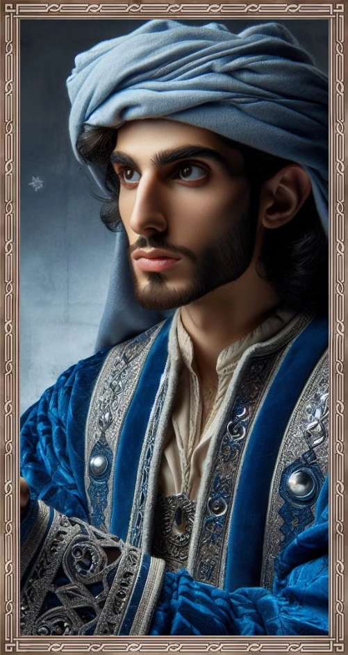
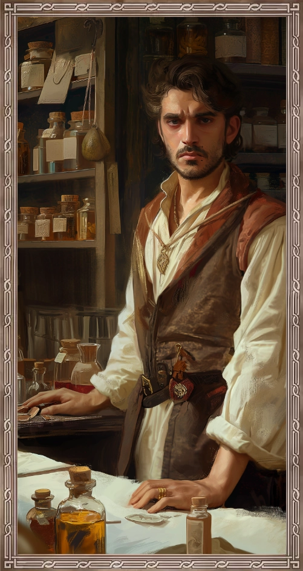
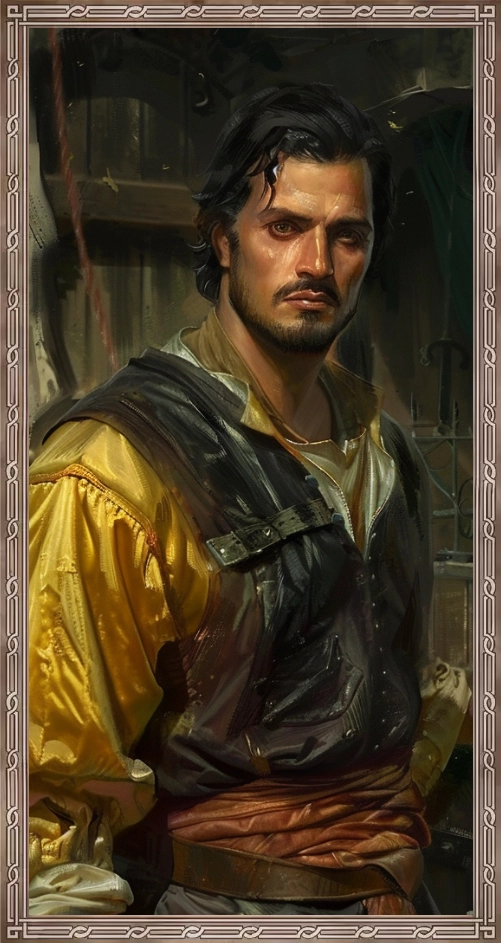

## Das schwarze Auge - 40. Runde der Kampagne: Greifenfurter Adel

### Die Bitte

 

Nach etwas über einem Monat der Recherche tat es gut, endlich einmal aus der Bibliothek herauszukommen. Und ich muss gestehen, dies galt vor allem für die Fakultät des Eises. Man muss diesem Element schon in besonderer Weise zugetan sein, um für längere Zeit freiwillig in einem Iglu zu leben. Hätte es nicht die vielen magischen Annehmlichkeiten gegeben, ich hätte wohl ein oder zwei Zehen verloren.

Allein schon deshalb war ich der Bitte, die Mahmud ibn Umran sal Hidaybeth Al'achami gegenüber seinem „allerbesten Freund“, seinem „Bruder im Geiste“ äußerte, nicht abgeneigt. Allerdings war es auch ein recht wichtiges und edles Ansinnen, da es darum ging, die wunderschöne Aishulibeth abu’l Aram, Mahmud große Liebe zu retten. Diese war wohl unverschuldet in eine Art Fede zwischen Mahmud, Federigo Alcorta und Gonzalo Jurios geraten. Einer alten Fede, an deren bestehen mein Kamerad nicht ganz unbeteiligt war.

Zu ihren Studienzeiten hatten sich Gray und Mahmud wohl mit zwei schnöseligen Schlägern aus Ragath angelegt und diesen immer wieder Streiche gespielt. Nun hatte es den Anschein, dass diese Beiden ihrer Verbrecherkarriere mit der Entführung der schönen Aishulibeth Vorschub geleistet hatten. Darüber hinaus versuchten sie Grays alten Studienfreund zu erpressen, denn dieser sollte ihnen Wertvolles aus dem Konzil der Elemente bringen. Sie wollten von ihm, dass er Artefakte und Bücher mit wertvollem Wissen stahl und sie ihnen brachte.

### In Ragath

 

Für meine Kameraden und mich war es selbstverständlich Grays Freund zu helfen, die Liebe seines Lebens zu retten und so machten wir uns, abgesehen von Link auf den Weg nach Ragath. Schon auf dem Weg genossen wir, dass sich das Wetter gebessert hatte und der Herbst sich von seiner besten Seite zeigte. Kaum angekommen quartierten wir uns in einem herrlichen Gasthaus mit Weinstube ein. Letzteres ist eine besondere Eigenart im Fürstentum Almada, in der sich die Gastfreundschaft von Land und Leuten zeigt. In der Weinstube des Gasthauses konnten wir die reiche Weinkultur von Almada erleben. Die Auswahl an Weinen war beeindruckend, mit Sorten, die die Vielfalt der Region widerspiegeln. Jeder Wein erzählte eine Geschichte, von der sorgfältigen Pflege der Reben bis zur Kunst der Weinherstellung. Wir hatten das Glück, die subtilen Unterschiede zwischen den verschiedenen Weinen kennenlernen zu können. Es war faszinierend zu erfahren, wie das Klima und der Boden der Region die Aromen und Texturen der Weine beeinflussen. Doch ich schweife ab.

Da wir nicht sicher sein konnten, ob sich Federigo oder Gonzalo noch an Gray erinnern und in daher vielleicht auch wiedererkennen würden, blieben wir zu Sicherheit der anderen in der Weinstube zurück, während Boronep, Andaryn und Zayn sich einmal die Apotheken der Stadt etwas genauer anschauten. Leider hatten sie von ihrer Erkundung nicht viel zu berichten.

Da ich aus mir unbekannten Gründen – vielleicht das Wetter – einen heftigen Kopfschmerz entwickelt hatte, beschloss ich, dass es durchaus noch im Rahmen wäre, mir die nächstgelegene Apotheke selbst einmal anzuschauen. Dort erkundigte ich mich mit der gebotenen Höflichkeit nach einem entsprechenden Medikament und erwähnte, wenn ich mich recht erinnere auch Federigos Namen. Vermutlich in diesem Zusammenhang wurde mir die Wahl zwischen dem regulären und dem guten Medikament eröffnet und da die Schmerzen durch aus argh waren, entschied ich mich für Letzteres. 

### Drogen

Später trafen wir uns alle in einem schönen Gasthaus in Ragath und nahmen ein gemeinsames Mahl ein. Als ich im Anschluss meine Medizin nehmen wollte, wurde Boronep unruhig. Seiner Meinung nach sollten Medikamente gegen Kopfschmerzen zu Tabletten gepresst sein und nicht in Pulverform eingenommen werden. Er bestand darauf, dass ich ihm das Medikament gab. Ich muss zugeben, dass ich ihn zuerst nicht ernst nahm und dachte, er hätte sich an dem hervorragenden Wein, der hier üblich war, etwas zu sehr bedient und nun einen Kater hatte.

Wie sich jedoch herausstellte handelte es sich bei dem Pulver um irgendeine Form von Droge. Von daher bin ich dem guten Boronep sehr dankbar, dass er mich mit seiner Aufmerksamkeit davor bewahrt hatte, dieses widerliche Zeug zu mir zu nehmen. Obendrein lieferte er uns damit auch eine entscheidende Erkenntnis über die tatsächlichen Tätigkeiten von Federigo. 

Wie sich am nächsten Tag herausstellte, hatte sich Boronep irgendwie mit dem anderen Apothekarius der Stadt angefreundet. Dieser stieß um die Mittagszeit unerwartet zu uns und wie sich herausstellte war Federigo dereinst sein Lehrling. Er berichtete uns, dass er vermutet, dass Federigo ihn in all den Jahren immer zu bestohlen haben musste, da immer wieder wichtige und gefährliche Ingredienzien fehlten und nach dem er ihn verlassen hatte, um in der anderen Apotheke zu arbeiten, wurde sein Laden kaum noch besucht. 

Es war nicht schön, dem Leid des alten Mannes zu lauschen, aber er schien froh zu sein, dass er jemanden zum Reden gefunden hatte. So erfuhren wir auch, dass sein ehemaliger Lehrling wohl im Osten der Stadt, direkt bei einem Lagerhaus und Handelskontor wohnte und nachdem sich der alte Mann verabschiedet hatte, beschlossen meine Kameraden sich dies einmal genauer anzuschauen. Da ich noch einige Studien durchzuführen hatte, blieb ich, mit vollem Vertrauen in die Fähigkeiten meiner Freunde, zurück.

Aus wir uns gegen Abend wieder in der Weinstube trafen, war ich erneut von diesen wetterbedingten Kopfschmerzen geplagt, wenn auch nicht im selben Ausmaß wie am Vortag. Die Kameraden berichteten von ihrer Erkundung, und dass es sich bei dem Haus wohl um das Elternhaus handeln muss. Sie haben Sachen von Federigo gefunden, aber nicht genug, um zu sagen, dass er dort noch viel Zeit verbrachte.

Zwar konnten wir in den zwei Tagen in Ragath einiges über Federigo in Erfahrung bringen, aber eine heiße Spur hatten wir noch nicht und von seinem Spießgesellen Gonzalo wussten wir noch gar nichts. Bevor wir als wieder zu Mahmud zurückkehren konnten, müssten wir wohl nicht ein wenig in Ragath verblieben um weitere Informationen zu sammeln.
