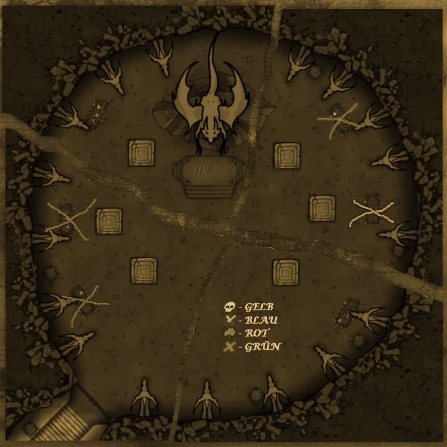

## DSK Session 13 - Aus den Erzählungen von Benjamin Büchernase

In der Milchschenke trafen wir Joka Schlaufuss, einen durch und durch gebildeten Kater. Selbstverständlich nutzte ich die Gelegenheit, nach all den Tagen wieder einmal einen gebildeten Diskurs zu führen und so lud ich den feinen Herren auf eine feine Tasse Sahne ein.

Im Laufe unserer Unterhaltung stieß Ruben zu uns und nach einer Weile drehte sich unser Gespräch um die uns fehlenden Kartenteile. Herr Schlaufuss wusste zu berichten, dass sich diese in Wolldorf befanden. Ein Stück war im Laden der 1000 Wunder und das andere entweder im Haus der Felle oder beim Farbenteich.

Da ich, bezüglich des Ladens der 1000 Wunder, von einer gesicherten Annahme ausgehen konnte, empfahl ich meinen Freunden die Suche dort zu beginnen. Leider erwarteten uns dort einmal mehr gar garstige Köter, auch wenn diese nicht wirklich mit einem Verstand beseelt waren.  So konnten wir diese Flohsäcke besiegen und ich darf berichten, dass ich daran nicht ganz unbeteiligt war.

Als Nächstes begaben wir uns zum Haus der Felle, was einen recht gruseligen Anblick bot. Allem Anschein nach begnügen sich die Zweibeiner nicht nur damit, das Fell von Bären und Löwons in ihren Häusern liegen zu haben. Dem hier zu ertragenden Anblick konnte man entnehmen, dass sie wohl generell gerne Tieren das Fell abziehen. Vielleicht sollte ich mich diesbezüglich mal mit meinem eigenen Zweibeiner unterhalten, wenn ich zurück in Havena bin. Der bekommt was zu hören.

Eigentlich sollte ich mich freuen, dass es nicht nur tote Tiere im Haus der Felle gab, doch die die dort lebten trachteten uns nach selbigen. Dennoch gelang es der geschickten Ravenna, das letzte uns fehlende Kartenstück zu entwenden. Ich glaube, sie tut alles, um mich zu beeindrucken.

Da die Nacht noch jung war, machten wir noch einen kleinen Abstecher zum Farbenteich. Dort färben die Zweibeiner ihre Stoffe. Eine höchst interessante Sache, aber ich muss gestehen, für einen Kater mit so einer feinen Nase, wie ich eine mein Eigen nenne, ist dies kein besonders angenehmer Ort. Ruben hingegen schien sich wohlzufühlen. Wir schauten uns ein wenig um, aber das Haus oder die Hütte, war derart von Ratten überrannt, dass wir kurzerhand beschlossen diese zu töten. Ich bin sicher, dass ich die Zweibeiner am nächsten Morgen über all die toten Nager gefreut haben.

Zurück in der Milch schenke setzten wir die Karte zusammen und sahen eine Art Grab oder Gruft. Ich hatte schon so eine Ahnung, dass es sich um einen Ort im Drachentempel handeln muss, doch wollten wir uns nicht allzu lange damit aufhalten, immerhin hatten wir auch endlich die fünf Murmeln in unserem Besitz.

Gemeinsam gingen wir also zu der Statue auf dem Dorfplatz und warfen nach kurzem Überlegen die Murmeln und die Löcher der Statue, worauf hin sich eine Kammer öffnete, der wir einen Schlüssel entnehmen konnten.

Es war also ähnlich wie in meinen Büchern. Daher wusste ich auch, dass wir nun zum Tor des Tempels mussten. Allerdings gingen wir sicherheitshalber vorab noch einmal einkaufen, damit es uns im Zweifelsfall nicht am nötigsten fehlen würde.
