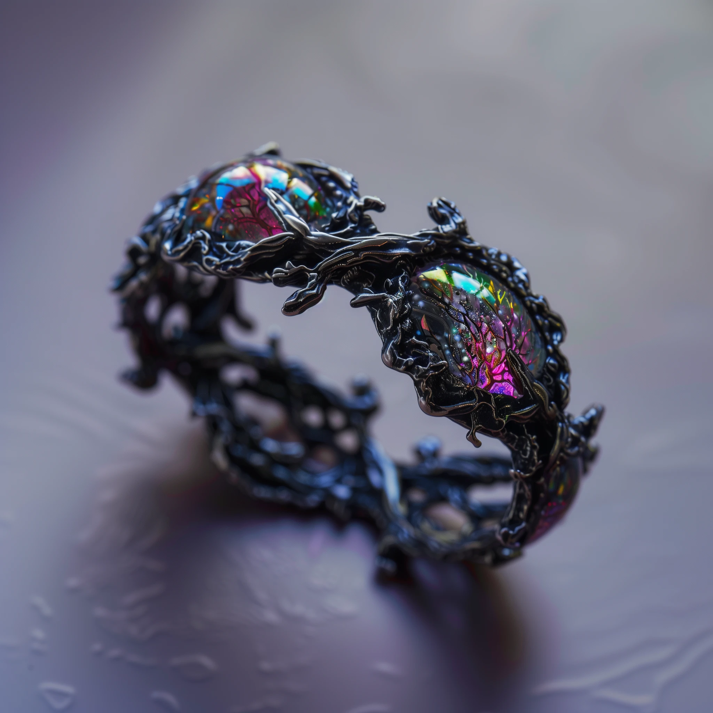

## Das schwarze Auge - 44. Runde der Kampagne: Greifenfurter Adel

### Ungebetener Besuch

Beseelt von dem zu tiefst befriedigenden Gefühl der Rechtschaffenheit und der festen Überzeugung, dass wir Gonzalo schnappen werden, unterlief uns ein Fehler. Zwar gingen wir, davon aus, dass wir Probleme mit unserem Widersacher aus Ragath bekommen würden, aber das Ausmaß schätzten wir völlig falsch ein. So war ich mehr als überrascht, als Gonzalo mit einem Dutzend seiner Spießgesellen, am helllichten Tag in die Weinstube stürmte. Ein kurzer Seitenblick zu meinem Freund dem Wirt verriet mir, dass dies nicht der Moment für einen Kampf war. Der Kollateralschaden würde vermutlich ins unermessliche gehen. Außerdem waren viele unbeteiligte Passanten anwesend. Schnell war ich umzingelt, von hinten wurde mir ein Sack über den Kopf gezogen, dann verspürte ich einen stechenden Schmerz, welcher sich, ausgehen von meinem Kopf durch den ganzen Körper zog. Dann wurde alles dunkel.

### Zu Gast

Als ich wieder erwachte befand ich mich in einem recht luxuriös eingerichteten Zimmer. Mein Schädel dröhnte, bedauerlicherweise nicht nur von dem Schlag, den ich einstecken musste. Man hatte mir auch eine Art Helm aus Eisen verpasst, welcher meinen Zugang zur Magie erschweren oder gar verhindern würde. Eisen ist für die, die von Mada gesegnet wurden, ein echter Fluch und bei diesem Helm schmerzte mich nicht nur das Eisen, sondern auch der Umstand, dass er nach allen Regeln der Kunst so angefertigt war, dass er unangenehm zu tragen ist, was einen Magier zusätzlich bei der für Zauber benötigten Konzentration stören würde. Eine Art Verschluss oder Schloss hinderte mich daran, dieses furchtbare Ding abzunehmen.

Dennoch war meine Unterbringung recht luxuriös. In meinem Raum befand sich ein kleiner Tisch mit Brot, Fleisch, Orangen, Wasser und Käse sowie einer Karaffe Wasser. Es gab bequeme Sitzgelegenheiten, ein Bücherregal und ein Fenster mit hervorragendem Ausblick. Bedauerlicherweise lag mein Zimmer wohl in einer Art Turm. So konnte ich es zwar öffnen, aber eine Flucht war unmöglich. Weiterhin hatte der Raum zwei Türen. Eine davon war verschlossen, die andere führte in ein kleines aber gut ausgestattetes Badezimmer.

Dieses Zimmer war nun für eineinhalb Tage mein goldener Käfig. Da ich nicht viel zu tun hatte verbrachte ich meine Zeit mit Lesen. Gelegentlich kamen Bedienstete, welche nicht mit mir sprachen, in der Begleitung von grimmigen Wachen. Man brachte mir frische Lebensmittel und sogar Kleidung. Ich muss zugeben, dass ich nicht einmal zuhause in einem solchen Luxus lebe. Auf der anderen Seite machen zu viele Annehmlichkeiten weich und sind schlecht für den Charakter. Dies war eine der Lehren am Kaiserlich Garethischen Lehrinstitut der angewandten kombattiven Magie, vom Schwert und Stabe zu Gareth. Eine der Wichtigsten möchte ich meinen.

In der Nacht konnte ich auf Grund des Helms kaum schlafen und während die Stunden vergingen glaubte ich einige Male seltsame Geräusche gehört zu haben. Vielleicht Gesang, vielleicht Schreie aber in Anbetracht der Kopfschmerzen, des Schlafmangels und der Tatsache, dass mir auch die Ohren unter dem Helm schmerzten, könnte ich mir dies auch eingebildet haben.

### Geschäfte

Am nächsten Tag wurde ich am späten Nachmittag oder frühen Abend von vier Wächtern zu den Pferdestallungen des Anwesens gebracht. Diese waren groß und im ragathischen Stil gehalten. Massive Steinwände, kunstvoll verzierte Türen und Fenster sowie ein gepflegter Innenhof mit Orangenbäumen prägten das Bild. Die Pferde standen in geräumigen Boxen aus dunklem Holz, versehen mit glänzenden Beschlägen. Die Atmosphäre strahlte Eleganz und Stolz aus, ein Zeugnis der tiefen Leidenschaft des Hausherrn für seine Tiere oder eine beeindruckende Zurschaustellung von Reichtum und Status.

In den Stallungen erwarteten uns weitere Wachen, doch diese waren im Gegensatz zu meinen vier Begleitern schwer gerüstet und bewaffnet. Ein Umstand, der sich als positiv erwies, nahmen sie mir doch endlich diesen unsäglichen Helm ab.

Kaum als ich die Stimmen meiner Kameraden vernommen hatte, brachte man mich zu ihnen. Sie saßen mit Karlos und Gonzalo sowie einem weiteren, alten Mann an ein einem Tisch auf einer Art Terrasse, tranken Wein und verhandelten. Etwas abseits stand noch ein vierter Mann, der zugleich fettleibig und muskulös war. Später erfuhr ich, dass es sich bei dem alten Mann um Fernando Jurios, dem Bruder von Karlos und bei dem Fleischberg um Esteban Carvajal, den Chef der Stadtwache gehandelt hatte.

Es dauerte einige Momente, bis ich den Faden des Gespräches aufnehmen konnte aber wie es aussah, war Karlos Furios der Meinung, dass wir ihm etwas schulden würden und nun sollten wir die Schuld begleichen. Dafür sollten wir nach Khunchom reisen. Dort trifft sich an jedem Praiostag zur Praiosstunde eine Gruppe Menschen an einem Ort, den man wohl die Universität nennt. Leider war damit keine echte Lehranstalt gemeint. Vielmehr war dies der Spitzname für ein Haus in einem der schlechteren Viertel von Khunchon, dessen Adresse niemand kannte. Diese müssten wir vor Ort selbst herausfinden. Wenn wir dies geschafft hätten, so sollten wir die älteste Person identifizieren, die am Treffen teilnimmt und sie töten.
  
Es war widerwärtig, was da von uns verlangt wurde, aber Gray führte die Verhandlung mit Karlos und es war immerhin meine Freiheit und Unversehrtheit, die er mit diesem Handel erkaufte. Daher schwieg ich. Auf dem Weg nach Khunchom, welchen wir auf Grund der Schriftrolle des Verlieses und dem alten Schuldschein, eh antreten wollten, würde uns schon etwas einfallen, so dachte ich zumindest. Doch dann öffnete Karlos eine Schatulle, welche schon die ganze Zeit auf dem Tisch stand. Darin befand sich ein Armband.

### Ein ungewolltes Geschenk

Das Armband bestand aus dunklem, fast schwarzem Metall, das wie verschlungene Wurzeln oder Äste geformt war. Die Struktur hatte etwas Lebendiges an sich, als würden die Metallstränge sich ständig bewegen und ineinander verschlingen. Eingebettet in diese unheimliche Metallstruktur waren mehrere irisierende Edelsteine, die in einem verführerischen, jedoch bedrohlichen Schimmer leuchteten. Die Edelsteine reflektierten das Licht in schillernden Farben, die von tiefem Violett bis zu glühendem Grün reichten, und strahlten eine düstere Aura aus, die sofort alle Blicke auf sich zog. Die Fertigung des Armbands war meisterhaft und doch unheimlich.

Karlos verlangte, dass einer von uns dieses Armband anlegen solle, warnte aber gleichzeitig davor, dass es eine unangenehme Nebenwirkung hätte. Es würde sämtliche Magie des Trägers unterdrücken. Entsetzt sahen Gray und ich uns an. Noch bevor wir protestieren oder Fragen hinsichtlich weiterer Nebenwirkungen stellen konnten zog Boronep dieses seltsame Ding an. Ich weiß nicht, ob es sein Mut war, aber er beeindruckte mich zutiefst und ein Blick zu meinen restlichen Gefährten verriet mir, dass es ihnen ebenso ging. Es war fast so, als wäre er größer oder mehr als sonst.

Die Familie Jurios schien jedoch gänzlich unbeeindruckt. Karlos freute sich, dass wir nun Geschäfte zu beiderseitigem Interesse machten. Ein Euphemismus, der seines Gleichen sucht. Dennoch, seine Selbstsicherheit lenkte meine Aufmerksamkeit von Boroneps Ausstrahlung wieder auf das Gespräch. Im selben Tonfall, in dem er von Geschäften im beiderseitigen Interesse sprach, erwähnte Karlos, dass der Verlust von Madas Gabe zwar nur eine Nebenwirkung sei, der eigentliche Sinn des Armbands wäre jedoch, dass nur er es wieder abnehmen könnte. Dies und dass es den Träger nach Ablauf von zwei Monaten qualvoll töten würde.

### Reisebegleitung

Dieser Karlos Jurios war ein Mann, der schwer zu durchschauen war und diesbezüglich waren wir nicht die einzigen. So erfuhren wir von ihm, dass uns sein Sohn Gonzalo begleiten würde und ich könnte schwören, dass dieser selbst erst in diesem Moment davon erfahren hatte. Zumindest schien er nicht sonderlich glücklich mit dieser Entscheidung zu sein und wie sich herausstellte, war dies auch als eine Art Bestrafung für ihn gedacht.

Nach dieser Überraschung entschuldigte sich Karlos höflich und man brachte uns zurück in die Taverne. Noch am selben Abend machten wir uns erste Gedanken zu einer möglichen Reiseroute. Mit nur 60 Tagen Zeit von Ragath nach Khunchom zu reisen, dort diesen "Auftrag" zu erfüllen und wieder rechtzeitig zurück zu sein, war eine Herausforderung. Wir überlegten, ob wir durch den Raschtulswall und die Wüste Gor reisen sollten, da dies die kürzere Strecke wäre, entschlossen uns dann aber von Perricum aus mit dem Schiff zu fahren. So könnten wir bei einer günstigen Verbindung einige wertvolle Tage sparen.
