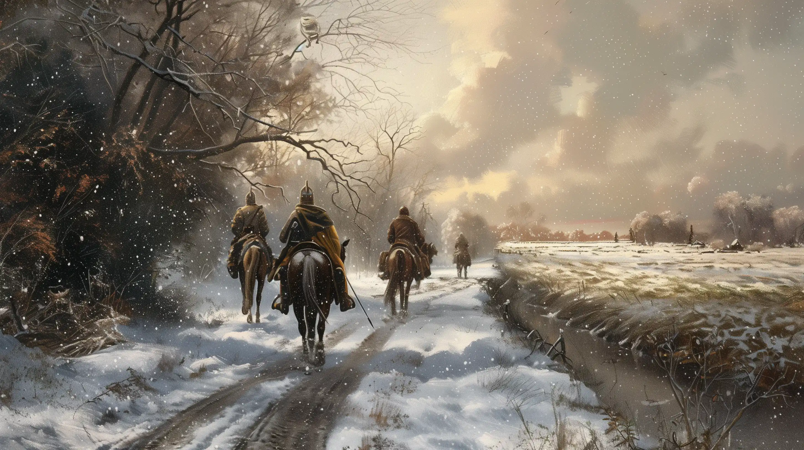
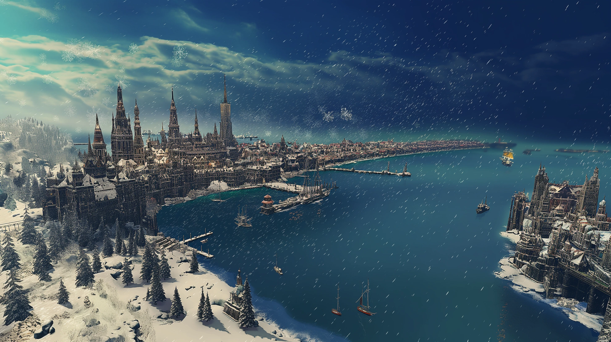

## Das schwarze Auge - 45. Runde der Kampagne: Greifenfurter Adel

### Aufbruch

Bei mildem Herbstwetter begann unsere Reise am frühen Nachmittag in Ragath, doch die Atmosphäre war alles andere als friedlich. Gonzalo Jurios erwartete uns vor dem Gasthaus und gemeinsam verließen wir die wehrhafte Stadt auf der Reichsstraße 2 in Richtung Nordosten. Bereits nach wenigen Minuten trafen wir auf die schwer bewaffneten Kavallerieeinheiten Ragaths, die entlang der Reichsstraße patrouillierten.

Diese scheinbar zufällige Begegnung mit der Patrouille, die unter dem Befehl von Esteban Carvajal, einem Verbündeten unseres Widersachers Karlos Jurios, stand, war eindeutig eine Machtdemonstration. Sie sollten uns zeigen, dass wir beobachtet und unsere Schritte genau überwacht werden. 

Die imposanten Schlachtreiter, die im Fürstentum Almada entlang der Reichsstraßen patrouillierten, waren eine ständige Erinnerung an die potenzielle Gefahr, die von unserem Auftraggeber ausging. Sollte es nötig sein, könnten diese Kavalleristen rasch gegen uns mobilisiert werden.

### Von Ragath nach Franfeld

Die erste Etappe führte uns nach Ciragad, einer friedlichen Ortschaft am Ufer des Yaquir. Doch die Ruhe des Ortes konnte unsere Anspannung nicht lindern. Die drängende Pflicht, den Auftrag zu erfüllen, trieb uns weiter. Nach einer kurzen Rast setzten wir unseren Weg fort und erreichten bei Einbruch der Dämmerung Wilsemund. Hier fanden wir Unterkunft in einem kleinen Gasthaus, doch Gonzalos wachsamem Blick entging nichts, und so blieben wir auf der Hut.

Der nächste Morgen brachte uns auf einen Weg durch offene Felder und Wiesen, deren herbstliche Farben kaum über die bedrückende Stimmung hinwegtrösten konnten. Am Abend erreichten wir Franfeld, wo uns Regen und Dunkelheit empfingen. Die mächtigen Mauern der Grenzfeste Franfeld, die über die Almadanische Pforte wachen, boten uns Schutz für die Nacht. Doch das Grollen eines Sturms ließ uns nicht gänzlich zur Ruhe kommen. Außerdem vermuteten wir, dass wir in der Nacht gehört hatten, wie Gonzalo durch die Flure schlich.

### Von Franfeld nach Eslamsgrund

Früh am Morgen verließen wir Franfeld wieder. Die Straßen waren matschig und der Himmel dunkel. Unsere erste Zwischenstation war Grannerau, wo die Dorfbewohner trotz der nahenden Winterkälte gastfreundlich blieben. Die Kälte des späten Herbstes nahm zu, als wir Steynebruk erreichten, eine Ortschaft, deren Bewohner uns mit Misstrauen begegneten, besonders Gonzalo.

Der weitere Weg nach Eslamsgrund war lang und beschwerlich, der Wind sowie die ersten Schneeflocken machten die Reise unangenehm. Eslamsgrund erreichten wir spät in der Nacht.

### Von Eslamsgrund nach Wiesengrund

Die Abreise am nächsten Tag begann verspätet, da Gonzalo uns etwa eine Stunde warten ließ und dies, obwohl erneut ein besonders langer Reisetag vor uns lag.

So traten wir an diesem Tag unsere Reise durch die frostige Landschaft der Baronie Erlenstamm mit schlechter Laune an. Ein Umstand, der sich bei diesem anspruchsvollen Streckenabschnitt auch nicht mehr ändern wollte. Der Boden war hart gefroren, mit einer Frostschicht überzogen und der Wind blies uns eisig ins Gesicht. Mit letzter Kraft erreichten wir nach einem 15-stündigen Ritt Wiesengrund, wo uns eine kalte Scheune als Unterkunft diente. Gonzalo verschwand kurz nach unserer Ankunft in einem der Häuser der Siedlung und wir mussten die Nacht in der Kälte verbringen.

### Von Wiesengrund nach Wandleth

Nach einer schmerzhaften Nacht setzten wir am darauffolgenden Tag unsere Reise fort. Die Kälte wurde unerträglich, und die ersten Schneeflocken fielen bereits vom Himmel. Nach ca. neun Stunden erreichten wir Wandleth. Die Stadt ist geprägt von zwergischer Architektur und bot alle erdenklichen Annehmlichkeiten. Die Burg, das Wiesenschlösschen, ein aus rosafarbenem Marmor erbautes Schloss, wirkte in der Abenddämmerung einladend und imposant. Wir fanden Unterschlupf im Gasthaus „Zum Wiesenschlösschen“, das für seine Gemütlichkeit und gute Küche bekannt ist.

Nach einer kleinen Stärkung beschlossen wir, die Stadt zu erkunden und unseren Proviant aufzustocken. Während unseres Einkaufes sahen wir eine Gruppe von Menschen, die sich um einen Prediger der Wandlether Apokalyptiker versammelt hatten. Er verkündet lautstark die bevorstehende Apokalypse und warnt die Bürger vor dem kommenden Unheil.

### Von Wandleth nach Wasserburg

Früh am Morgen brachen wir auf, Gonzalo ritt wie immer hinter uns und blieb weiterhin distanziert. Die hügelige Landschaft der Baronie Ingerimmsschlund war von herbstlichen Farben bedeckt, doch die Kälte und die Anstrengungen der Reise ließen uns die Schönheit kaum wahrnehmen. In Perainsgarten, einer kleinen Ortschaft, sahen wir die ersten Anzeichen des hereinbrechenden Winters. Der erste Schnee hat die Dächer leicht bedeckt und die Bewohner waren damit beschäftigt, ihre Häuser und Scheunen auf die kalte Jahreszeit vorzubereiten. Wir nutzten die Gelegenheit, um uns und unseren Tieren eine kurze Rast und eine kleine Stärkung zu gönnen; dann setzten wir unsere Reise fort.

Nach vielen weiteren Stunden, die wir auf dem Rücken unserer Reittiere verbracht hatten, fanden wir eine kleine Travia-Hütte und beschlossen, dort die Nacht zu verbringen. Es war eine Selbstverständlichkeit für uns, die Vorräte aufzufüllen, Holz zu hacken und eine kleine Spende zu hinterlassen, um der Göttin Travia unseren Respekt zu erweisen.

Der nächste Tag führte uns weiter entlang des Darpat. Das Wasser des Flusses war bereits von einer dünnen Eisschicht bedeckt, und die Kälte machte die Reise unerträglich. 

Als wir schließlich Wasserburg erreichten, war es bereits früher Abend. Die mittelgroße Stadt liegt auf einer Insel im Darpat, und die Brücke, die zur Stadt führt, wirkte im Schneegestöber und Dämmerlicht fast mystisch. Die Lichter der Stadt spiegelten sich im Wasser, und wir waren froh, endlich eine Möglichkeit zur Rast in einem Gasthaus nahe dem Stadttor gefunden zu haben.

### Von Wasserburg nach Perricum

Am nächsten Morgen brachen wir früh auf. Die Winterkälte war allgegenwärtig und der Himmel von grauen Wolken bedeckt. Der Wind peitschte durch Wasserburg und wir waren froh, als wir die Stadt hinter uns ließen und wieder auf die Reichsstraße 3 entlang des Darpat gelangten.

Wir ritten zügig, doch die Straßen waren rutschig. Gonzalo beobachtete uns weiterhin misstrauisch. Nach einigen Stunden erreichten wir Gnitzenkuhl. Die Dorfbewohner waren freundlich, aber zurückhaltend, und wir verweilten nur kurz. Dennoch ließ Gray es sich nicht nehmen, einen Vorrat des berühmten Fruchtbrands Gnitzer zu erwerben.

Die Kälte machte die Reise beschwerlich und als wir Gaulsfurt erreichten, neigte sich der Tag dem Ende zu. Die Ortschaft war friedlich, und wir beschlossen, dort zu übernachten. Im Gasthaus wärmten wir uns am Kaminfeuer. Später besuchten wir die nahegelegene Tempelanlage Raschia'Hal, wo ich eine größere Spende hinterließ.

Gonzalo verschwand am späten Abend wortlos im Dorf und wir gingen zu Bett, blieben aber wachsam. Am nächsten Morgen setzten wir unsere Reise fort, doch das Wetter wurde zunehmend ungemütlicher. Gegen Mittag erreichten wir Rabicum und stärkten uns aus unseren Vorräten.

Die letzte Etappe führte uns nach Perricum. Als wir schließlich die Stadt erreichten, war es tief in der Nacht. Wir fanden Unterkunft im Gasthaus „Der Hartsteener“. Gonzalo blieb bei uns, schweigsam, aber anwesend.

Die Nacht in Perricum war ruhig, doch die Geräusche der Großstadt und das Rauschen des Meeres ließen uns nicht vollständig zur Ruhe kommen. 

### In Perricum

Am Morgen genossen wir ein einfaches Frühstück im Gasthaus „Der Hartsteener“ welches im Stadtteil Darpatstieg, nahe dem Ingerimm-Tempel und dem Hafen lag. Trotz der Kriegsnarben in Darpatstieg hatte das Gasthaus überlebt und bot eine einfache, aber gemütliche Atmosphäre. Der Wirt, Hartmut, servierte uns frisches Brot, dicken Käse und Haferbrei. Der Duft von heißem Tee und gebratenem Speck erfüllte den Raum.

Nach dem Frühstück machten wir uns auf den Weg zum Hafen. Die Straßen von Darpatstieg waren belebt, aber die Narben des Krieges waren überall sichtbar. Die Bewohner trugen dicke Mäntel und trotzten der Kälte. Der Hafen war geschäftig, Händler feilschten und Seefahrer bereiteten ihre Schiffe vor.

Am Kai sahen wir, wie ein Schiff Richtung Süden davonfuhr. Die Segel blähten sich im Wind, und das Schiff entfernte sich rasch. Ein alter Seemann erklärte uns, dass die „Seeadler“ erst in mehreren Wochen zurückkehren würde, da sie über Khunchom bis nach Havena segelte.

### Suche nach einer neuen Passage

Wir fragten die Seeleute und Matrosen am Hafen nach Auskunft, wann das nächste Schiff Perricum Richtung Khunchom verlassen würde, aber in der Winterzeit fuhren nur noch selten Schiffe.  Man riet uns, in den Handelshäusern und Kontoren zu fragen, ob und wann Schiffe fahren würden. 

Im Kontor der Mada Basari erfuhren wir, dass eines der Schiffe, die Sonnenwind, in drei Tagen nach Selem aufbrechen und auf dieser Reise auch Post nach Khunchom bringen würde. Da es sich bei dem Schiff um ein Frachtschiff handelte, standen keine Kabinen zur Verfügung, aber dies ermöglichte uns, unsere Pferde mitzunehmen. Für einen kleinen Aufpreis sollte das Schiff entsprechend umgebaut werden. So wurden wir uns schnell mit dem Inhaber des Kontors handleseinig und hatten nun drei ruhige Tage in Perricum vor uns.