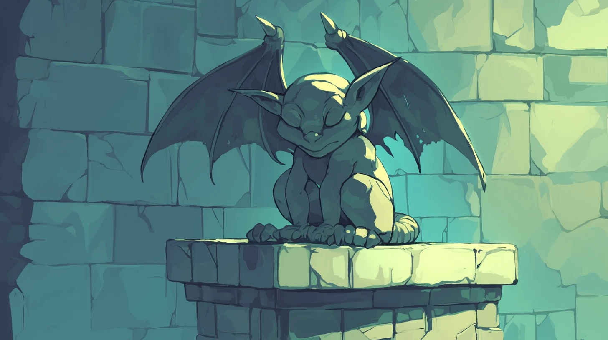

## DSK Session 18 - Aus den Erzählungen von Benjamin Büchernase

Es war ein schöner Tag in Havena, und ich genoss die ersten Sonnenstrahlen auf der Treppe meines beschaulichen Hauses. Es lag zentral in einer der besseren Gegenden der Stadt und war recht groß. Daher machte es mir auch nicht allzu viel aus, es mit einigen Zweibeinern zu teilen. Immerhin versorgten sie mich dafür auch mit allem, was ich im Leben brauchte. Gerade als ich dachte, dass es nicht besser sein könnte, vernahm ich ein schüchternes "Hallo". Zugegebenermaßen etwas träge öffnete ich ein Auge und erblickte die wunderschöne Kitty Kuschelpfote aus Wolldorf.

Zwar hatte ich die Gute eingeladen, mich in Havena zu besuchen, aber ich hätte nicht damit gerechnet, dass sie mit Gesellschaft kommen würde …

Und trotzdem, in ihrem Schlepptau erkannte ich drei Katzen, die wir während unserer Zeit in Wolldorf kennengelernt hatten. Kieran Nachtgesicht, Alanna Morgenstern und Sakura Sternwanderer standen nur wenige Schritte hinter Kitty und schauten betrübt aus der Wäsche.

### Taverne

Mein Anstand verbot es mir, die Katzen aus Wolldorf einfach so auf der Straße stehenzulassen, also ging ich mit ihnen in die Taverne unter die Riesen, wo wir auch auf Inigo, Jack und Ruben trafen. Während ich eine leckere Sahne genoss, schilderten unsere Überraschungsgäste meinen Freunden ihr Leid.

Ihre Kameraden, also Gadhra vom Schwertturm, Meroth aus dem Fass und Nino Blütentasche, hatten Kieran, Alanna und Sakura das letzte Mal gesehen, als sie gemeinsam in einen Hinterhalt der Drei Krallen gerieten. Während unsere Gäste die Gefangenschaft der selbst ernannten Wächter von Wolldorf und die Verbannung auf die Möwe genossen, konnten die anderen fliehen. Nachdem die Sache mit dem verfluchten Schiff und Moloch überstanden war, haben sie sich auf die Suche gemacht.

Es gab wohl Spuren, dass die anderen Wolldorf verlassen hatten, doch diese verliefen sich nach einer Weile. Seltsamerweise wussten weder die Drei Krallen noch Saytan Wollsammler etwas über den Verbleib der Geflüchteten. Scheinbar hatten diese ihre Sache gut gemacht. Ohne einen Anhaltspunkt konnte uns nur noch ein Wunder helfen – oder eine Weissagung.

Eine Weissagung, das könnte die Lösung sein. Ich erinnerte mich an die Geschichten über das Orakel von Havena, eine geheimnisvolle Schleiereule, die angeblich das Wissen der Welt in sich trägt und in Vergangenheit sowie Zukunft blicken kann. Diese schattenhafte Patronin der Katzen von Havena soll hoch oben in einem Turm des goldenen Hauses in den Unterfluren nisten. Man sagt, dass das Orakel nur zu wenigen Auserwählten spricht, und auch dann sind seine Worte oft kryptisch und schwer zu entschlüsseln.

Der Weg zu ihr ist allerdings gefährlich, denn das goldene Haus ist der Stammsitz der goldenen Horde, einer Gruppe von arroganten, verwöhnten Aranierkatzen. Diese fettleibigen Rotfelle genießen die Verehrung der praiosgläubigen Menschen, die sie füttern und pflegen. Trotz der Gefahr, die von diesen faulen, aber feigen Katzen ausgeht, beschloss ich, dass wir es wagen sollten, das Orakel aufzusuchen. Vielleicht konnte uns seine Weissagung den entscheidenden Hinweis auf den Verbleib der Vermissten geben.

### Orakel

Wir machten uns also mit Kieran, Alanna und Sakura auf den Weg und wie vermutet saßen die Aranier auf dem Platz vor dem Goldenen Haus. Allerdings muss ich gestehen, dass die Gerüchte über deren Fettleibigkeit doch etwas übertrieben waren. Im Gegenteil. Mir fielen einige wohlproportionierte Kätzchen auf.

Als verantwortungsvoller Anführer war es eine Selbstverständlichkeit für mich, für ausreichend Ablenkung zu sorgen. Daher machte ich einigen der Katzen schöne Augen und ließ meinen Charme spielen. Spielend gelang es mir, die Damen um den Finger zu wickeln. Zu meiner Schande muss ich gestehen, dass ich, auch wenn es für einen guten Zweck war, meine Gabe der Verführung ausgenutzt habe, um die Aranierkatzen und -kater dazu zu bringen, sich mit mir an einen ruhigeren Ort zurückzuziehen. Allem Anschein nach habe ich es aber ein wenig übertrieben, denn auch Inigo und Ruben schlossen sich der liebestollen Meute an. Lediglich Jack blieb ungerührt, aber er hatte da ja auch einen gewissen Vorteil … oder Nachteil. Das kommt wohl ganz auf die Perspektive an.

Wir verbrachten eine schöne Zeit, doch leider mit einem bitteren Nachgeschmack. Diese unverschämte Araniererin hat mir doch tatsächlich mein wunderschönes Medaillon und ein Stück der alten Tempelkarte gestohlen. Inigo hat es noch viel schlimmer erwischt. Dem Armen fehlten am Ende seine Rüstung und ein Schwert und ich wundere mich noch heute, wie er so unaufmerksam sein konnte. Der kleine dicke Ruben hingegen hat rechtzeitig bemerkt, was vor sich ging, hat aber, anstatt uns zu warnen, eine philosophische Diskussion über Richtig und Falsch mit der Katze geführt, die ihn ausnehmen wollte. Am Ende wollte er dem frechen Ding noch aus der Patsche helfen. Na ja, wenigstens hat er das Herz am rechten Fleck.

Nach diesem unrühmlichen Vorfall berappelten wir uns wieder und beschlossen zum Orakel zu gehen. Da sich die Aranier aus dem Staub gemacht hatten, war der Weg frei und nichts hielt uns mehr auf. Sogar Jack, der sich ein wenig umgesehen hatte, stieß wieder zu uns.

Wir schlichen also durch das Goldene Haus, vorbei an vielen Statuen der Zweibeiner, bis zum Turm hinauf, wo wir an einem Fenster das Orakel fanden, das den leuchtenden Mond beobachtete. Ein Umstand, der meinem umfänglichen Wissen nach für Schleiereulen nicht unüblich ist.

Für Orakel hingegen ist es unüblich, eine Bezahlung zu verlangen, aber Spenden und Opfergaben sind wohl obligatorisch. Hier macht Ruben alle Versäumnisse dieses Abends wieder gut, indem er dem Orakel das "Maus auf Toast Sandwich" gab, das er wohlweislich von der Taverne mitgebracht hatte. Scheinbar hatte das Orakel auch wirklich genug von all den weißen Mäusen, die ihr üblicherweise angeboten wurden, und so schlang sie das Essen gierig herunter und belohnte uns mit einer Weissagung.

> Im Schoße des weiblichen Orks wird aus den Samtpfoten ein Werkzeug des menschlichen Tiers.

Ich tat mein Bestes, um aus diesem Rätsel schlau zu werden und bat sogar das Orakel um Hilfe, doch leider konnte sie uns nichts Weiteres sagen. Allerdings schlug sie vor, dass wir uns mal in der Bibliothek umschauen sollten. Dieser Vorschlag war so gut, der hätte glatt von mir sein können.

Wir zogen also von dannen und verließen das Goldene Haus. Zu unserem Entsetzen lag auf dem Platz, auf dem sich zu Beginn des Abends noch die Aranierkatzen getummelt haben, nun eine tote Katze. Eine tote Katze, die Jack wohl den Weg zum Orakel gezeigt hatte. Sie lag da, mitten auf dem Platz, gespickt mit Glassplittern. Das, obwohl nirgends ein zerbrochenes Fenster zu sehen war. Bei genauerem Hinsehen erkannten wir, dass die Katze mit einer Glasscherbe erstochen wurde. Scheinbar sollte die Weissagung des Orakels nicht das einzige Rätsel an diesem Abend bleiben. Aber wir mussten weiter. Die Bücher warteten.

### Bibliothek

Die Bibliothek, ein Ort des Geistes und des Verstandes, mein zweites Zuhause. Aber scheinbar auch das Zuhause von zwei Kötern, die eifersüchtig den Eingang bewachten, was uns ein angemessenes Passieren des vorgesehenen Zugangs unmöglich machte. Wir sahen uns also gezwungen, einen anderen Weg in das Gebäude zu finden und prinzipiell wäre es auch kein Problem gewesen, dass ich über das Dach geklettert wäre. Allerdings hatten wir ja noch Kieran, Alanna und Sakura im Schlepptau und die sahen arg mitgenommen aus. Daher unternahm ich zusammen mit Ruben einen sehr halbherzigen Versuch, ein wenig zu klettern und ließ es dann bleiben. So konnten die anderen ihr Gesicht wahren.

Dennoch mussten wir irgendwie in die Bibliothek und Jack hatte die passende Idee. Er zögerte nicht lange und gab Inigo seine schwere Rüstung und sein Schild. Während wir uns versteckten, lenkte er die Aufmerksamkeit der Hunde auf sich und flitzte blitzschnell um eine Ecke, vorbei an noch mehr Hunden. Auch diese rannten ihm nach, sodass nun eine ganze Meute hinter ihm her war. Ich bekam noch mit, dass er sich zwar auf einen Baum retten konnte, aber einiges einstecken musste.

Wir hingegen schlichen uns in die Bibliothek, die selbst zu dieser späten Stunde noch von Zweibeinern besucht war. Mutig ging ich voran und entdeckte schon bei den ersten Regalen Zweibeiner-Welpen. Damit ich die Bücher inspizieren konnte, bat ich Alanna und Ruben, diese für mich abzulenken.

Das Vorgehen war klar, wir mussten uns unserer Kleidung entledigen, um wie normale Katzen zu wirken. Dann einfach nur zu den Menschen gehen und sich auf dem Rücken rollen. Das klappt fast immer, was Alanna und Ruben eindrucksvoll unter Beweis stellten.

Ich hingegen widmete mich dem wichtigen Teil und nahm das Büchersortiment in Augenschein: Reihe um Reihe, Regal für Regal. Leider fand ich nichts, was uns einen Hinweis liefern konnte. Mir war klar, dass wir uns auch in den anderen Teilen des Hauses umschauen mussten, daher bat ich die anderen beiden, mit dem Spielen aufzuhören und mir zu folgen.

In einem Raum mit Treppen zum Keller und zum Obergeschoss schliefen zwei Dachse. Hätte nicht auch ein Kater ruhig und friedlich in einer Ecke des Raumes gesessen, wäre das ein Anlass zur Sorge gewesen. So hingegen blieb ich cool und ließ mich auf ein leises Gespräch mit dem Herren ein. Wie sich herausstellte, verkaufe er Karten von Aventurien und um ihn gewogen zu stimmen, kauften Ruben und ich einige seiner Stücke.

Daraufhin erzählte er uns freudig von einem geheimnisvollen Buch im Keller des Anwesens. Ich war zwar nicht sicher, was wir in Anbetracht eines geheimnisvollen Orakelspruches auch noch mit einem geheimnisvollen Buch anfangen sollten, aber sicherlich war es besser, einmal nachzuschauen. Allerdings warnte uns der Kater mit den Karten vor dem Keller.

### Keller

Aus vielen meiner Bücher weiß ich, dass in Kellern Ratten hausen und es Helden bedarf, die diese widerlichen Tiere erschlagen. Genau diese Aufgabe erwartete uns auch im Keller der Bibliothek. Ich machte kurzen Prozess mit den Viechern, aber meine Kameraden schlugen sich ebenfalls relativ gut. Kaum hatten wir die Ratten vertrieben, sah ich mich in dem ersten Kellerraum um. Schnell fiel mir eine alte hölzerne Standuhr auf, wie nicht so richtig in den Raum passen wollte und Ruben sah sich das Ding einmal genauer an. In der Uhr entdeckte er einen versteckten Heiltrank, den wir noch gut gebrauchen konnten.

Am anderen Ende des Raumes fanden wir eine schwere Tür, die in einen weiteren Raum führte, der seltsamer nicht sein konnte. In der Mitte des Raumes war eine Art Metallgitter oder -geflecht in den Boden eingelassen, in dessen Zentrum ein Bücherpult stand. An den vier Ecken des Metallgitters standen Steinstatuen in Form von Gargoyles. Außerdem stand auch in diesem Raum eine Uhr, dessen Heiltrank ich mir sicherte.

Gemeinsam standen wir vor dem Metallgitter und überlegten, was zu tun sein. Vorsichtig setzte ich eine Pfote auf das Metall und sofort ertönte ein Klappern und Scheppern. Fieberhaft überlegte ich, welch ein Geheimnis hinter all dem stecken könnte. Schnell wurde mir klar, dass dies nicht der Moment für langwierige Überlegungen war. Handeln war gefragt und das tat ich. Ich rannte so schnell ich konnte zum Zentrum des Geflechtes und schnappte mir das Buch. Grade, als ich mich umdrehte, sah ich, wie sich meine Freunde den Wasserspeiern stellten, die auf einmal zum Leben erwacht waren. Ich brachte das Buch in Sicherheit und half Inigo und Ruben im Kampf gegen die Steinmonster. Dabei mussten wir alle heftig einstecken und ich bin wirklich dankbar für die Heiltränke, die wir gefunden hatten. Die Statuen waren nahezu unbesiegbar, aber als keiner von uns mehr auf dem Metall stand, war der Spuck vorbei. Inigo hatte es übel erwischt und wir anderen hatten heftige Blessuren. Ein erster Blick in das geheimnisvolle Buch machte aus klar, dass mein Mut und die Aufopferung meiner Kameraden umsonst gewesen war. Dieses literarische Machwerk war voll von sinnlosem Gekritzel, aber zumindest war es geheimnisvoll.

Enttäuscht verließen wir den Keller wieder.

### Die Suche geht weiter

Im Raum mit dem Kartenhändler trafen wir Jack wieder, der den Hunden entkommen war. Es war ihm gelungen, sich über das Dach in das Gebäude zu schleichen, wovon er eifrig berichtete. Leider hatte ich keine Zeit, ihm hinsichtlich seiner Erzählungen die Gunst meiner Aufmerksamkeit zukommen zu lassen. Es galt, Hinweise auf eine Weissagung zu finden, und in dieser Bibliothek war ich in meinem Element. Ich erinnerte mich, dass es nahe dem Eingang noch eine Tür gegeben hatte, die zu einem weiteren Raum mit Büchern führen konnte und ich beschloss dies zu prüfen.

Es dauerte nicht lange und einige der anderen folgten mir, aber ich war mit meinen Gedanken ganz bei den Büchern und bei meiner Aufgabe, einen Hinweis zu finden. Vermutlich hätten andere, weniger willensstarke Katzen, längst aufgegeben, doch ich hatte den Anspruch, meinem stolzen Namen gerecht zu werden.

Nachdem das ganze Erdgeschoss abgesucht war, erinnerte ich mich, dass Jack irgendetwas von Büchern im Obergeschoss gemurmelt hatte, aber auch, dass sich dort Zweibeiner herumtrieben. Und dennoch, wer nichts wagt, kann auch nichts gewinnen. Wir gingen als gemeinsam nach oben.

### Obergeschoss

In dem Raum, den wir am Ende der Treppe vorfanden, war eine Zweibeinerin an einem Herd beschäftigt. Unsere Suche sowie unser Interesse für den Küchentisch erschreckte sie jedoch sehr und so verließ sie schimpfend den Raum. Auf dem Tisch fanden wir weitere Karten, welche wir sicherheitshalber mitnehmen. Leider hatte dieser Raum nichts, was uns einen Hinweis gab, so begannen wir die anderen Räume zu durchsuchen.

Der Raum, der an der Küche anschloss, hatte fünf Regale voll mit Büchern, aber keins davon war in irgendeiner Form hilfreich bei der Lösung unseres Rätsels. Erst im letzten Raum des Hauses, den wir erreichen konnten und als hätte das Schicksal so beabsichtigt, fand ich eine hilfreiche Karte des nordwestlichen Aventuriens. Auf dieser Karte war die Insel Orkin verzeichnet. Mir war sofort klar, dass dies eine Referenz zu "Im Schoße des weiblichen Orks" sein musste. Leider bemerkten die Zweibeiner, die sich hinter dem Regal aufgehalten hatten, dass ich die Karte genommen habe und sie begannen zu schimpfen und zu schreien. Dabei erwähnten sie jedoch auch andere erwachte Katzen. Während meine Kameraden versuchten zu fliehen, war mir sofort klar, dass wir hier nur mit einer geschickten Verhandlungsführung davonkommen würden. Wohlgemerkt, ein Sachgebiet, in dem ich durchaus brilliere. Mir gelang ein anständiger Handel, in dem ich die Bücher eintauschte, die ich auf der Möwe gefunden habe und mir war, als ob es Fügung war, dass ich sie damals mitgenommen habe.

Der erste Teil der Weissagung war also gelöst und die vielen Bücher über Affen und Menschenaffen geben mir auch einen klaren Hinweis auf den Teil mit dem menschlichen Tier. Es war also Zeit, wieder nach Hause zu gehen. Dummerweise hatten die Köter dieses Stadtteils nur darauf gewartet, dass wir das Gebäude verlassen. Daher mussten wir sie erst einmal ordentlich verprügeln.
