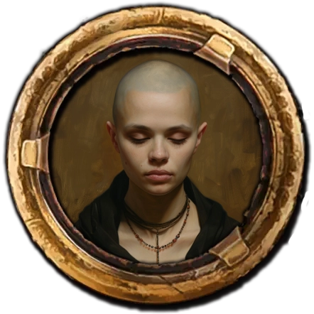

## Das schwarze Auge - 48. Runde der Kampagne: Greifenfurter Adel

Wir wurden gebeten, unsere Mitreisenden abzuholen. Daher begaben wir uns zum Kloster des Vergessens, am westlichen Rand der Stadt. An diesem Ort, an dem die seelisch Kranken gepflegt werden, war es anders als erwartet. Es war ruhig, sehr ruhig. Ich hätte mit Schreien oder Ähnlichem gerechnet. Mit Verrückten, die durch die Flure und Säle toben. Aber es war einfach nur ruhig. Wenn man innehielt und lauschte, konnte man das leise Murmeln von Gebeten hören, aber dieser Ort zeigte wie kein Zweiter, dass Boron auch den Beinamen "der Schweigsame" trug.

 

Wir wurden zur Äbtissin des Klosters, Kalina Niodas, geleitet. Die Geweihte berichtete uns mit wenigen, aber mitfühlenden Worten vom Schicksal des ehemaligen Abtes Borondrian Dergelmund, welcher einer Art Manie anheimgefallen war und dem man hier in Perricum nicht mehr helfen konnte. Nun bestand die letzte Hoffnung darin, den alten Mönch zum Gründungsort der Noioniten, dem Kloster der Heiligen Noiona in Selem zu bringen.

Wir erklärten uns bereit, den ehemaligen Abt zusammen mit einer Novizin zum Schiff zu bringen, da es dem alten Mann, der sichtlich abgemergelt war, schwerfiel, alleine zu gehen. Die junge Novizin, ihr Name war Boronike Dengler, hatte sich in den vergangenen Wochen und Monaten um den Erkrankten gekümmert und würde dies auf der Reise weiter übernehmen. Auch hatte sich schon alles vorbereitet, um zeitig aufbrechen zu können.  So sprach die Äbtissin noch einen Segen über uns und wir machten uns mit unseren Begleitern auf den Weg zum Hafen. Das Schiff, die Sonnenwind, war bereits fertig beladen und brach auf, sobald wir an Bord waren.

Die See war rau und das Wetter eisig, der Wind blies von Osten und das Schneegestöber machte die Navigation zu einer Herausforderung. Abgesehen von Gray und der Mannschaft des Schiffes litten alle unter den harten Bedingungen. Besonders Boronep hatte es schlimm erwischt. Bereits am ersten Tag fiel er der Seekrankheit anheim und musste sich die meiste Zeit in der Nähe der Reling oder Kübeln aufhalten. Wie es hingegen Gonzalo erging, blieb uns ein Rätsel, da dieser nicht mehr aus seiner Kajüte heraus kam, nachdem das Schiff angelegt hatte.

Die junge Novizin kümmerte sich aufopferungsvoll um den ehemaligen Abt. Dem alten Mann bekam die Reise gar nicht. Er wirkte immer abwesender und entrückter. Die meiste Zeit plapperte er unverständliches Zeug vor sich hin. An einem Tag, an dem uns Boronike bat, kurz noch ihm zu schauen, war es besonders schlimm. Borondrian war scheinbar aufgebracht und versuchte sich mit uns in einer uns unbekannten Sprache zu unterhalten.

Ich verstand so etwas wie:

> "Ph'nglui mglw'nafh Yog-Sothoth R'lyeh wgah'nagl fhtagn..."

> "Ia! Ia! Yog-Sothoth k'yarnak y'gth'ye li'hee..."

> "Ng'gha Yog-Sothoth, k'yarnak li'e ch'agl nafl'th..."

> "Yog-Sothoth h'shagg li'e hr'an ch'ary... Ph'nglui mglw'nafh..."

Wir versuchten, ihn anzusprechen und ihn wieder ins Hier und Jetzt zu holen. Nach einer Weile würde seine Sprache langsam klarer:

> "Yog-Sothoth**! Zha'lon gu'rath."

> "Yog-Sothoth ist das Tor, Yog-Sothoth ist der Schlüssel und der Wächter des Tores."

Daraufhin hatte Link die Idee, dem verwirrten alten Abt einige unserer Schriftrollen zu zeigen. Immerhin hatten wir auch eine Rolle, die eine Art Tor oder Portal darstellte.

Die Schriftrolle des Schattentores und die Schriftrolle des Sternenkompasses veranlassten den aufgeregten Mann zu folgenden Äußerungen:

> "Träume sind der Pfad... die Portale zu den Traumlanden..."

> "Yog-Sothoth führt den Weg... die Sterne weisen den Pfad..."

Wir zeigten ihm weitere Schriftrollen. Bei der Rolle der Wächterhaut entfuhr es ihm:

> "Ehrt ihr die Zwölfe? Fürchtet ihr deren Widersacher? Ich habe sie alle gerufen aber sie wissen es nicht. Abgesehen von ihr. Doch sie versteht es nicht. Sie sind wie Kinder."

> "Sie, die in der Tiefe lauert, weiß es. Sie hat die Sterne beobachtet und den Fehler gesehen. So hat sie einen kurzen Blick erhascht. Nun versucht sie es zu vergessen, indem sie es Unschuldigen unter die Haut schiebt. Aber es hat auch sie gesehen und es lässt sie nicht mehr los."

Was deutete dieser Wahnsinnige da nur an? Das Beschwören von Göttern und Erzdämonen? Er musste wahrlich von Sinnen sein.  Dies zeigte sich besonders deutlich, als er die Rolle des Labyrinths in die Finger bekam. Er wollte sie gar nicht mehr hergeben. Er war wie besessen und behauptete, den Weg klar zu erkennen. Dabei wussten wir alle, dass es auf dem Bildnis keinen Weg gab. Wir mussten ihm die Schriftrolle letztlich abnehmen, da er sich immer tiefer in einen Wahn zu steigern drohte.

Was auch immer mit dem ehemaligen Abt des Klosters des Vergessens vor sich ging, es war sicherlich nicht nur eine einfache Manie, und wir beschlossen, das Erlebte mit der Novizin zu besprechen. Immerhin pflegt diese den seelisch Kranken schon eine ganze Weil und wusste daher vielleicht mehr über seinen Zustand.

Sie berichtet uns, dass er, noch zu seiner Zeit als Abt, versuchte, einem anderen Patienten, einem verrückten Magier, zu helfen. Dies trieb ihn mit der Zeit dazu, seine Pflichten als Abt zu vernachlässigen, um alte Bücher und Texte zu studieren, von denen er sich Hinweise auf die Krankheit des Magiers erhoffte. Irgendwann war es so schlimm, dass er selbst zu einem Patienten des Klosters wurde, aber man konnte ihm nicht helfen. Genaueres könnte sie uns leider nicht sagen. Aber sie gab uns, in der Hoffnung, dass wir vielleicht helfen könnten, die Aufzeichnungen der Brüder und Schwestern aus dem Kloster, die mit der Seelsorge des verrückten Magiers und des ehemaligen Abtes beauftragt waren.
