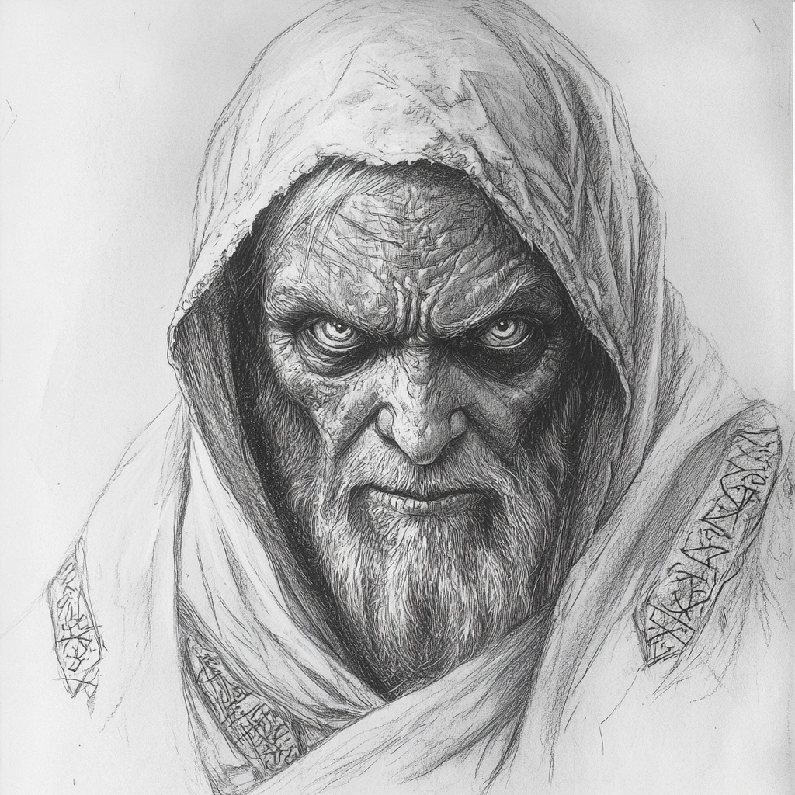
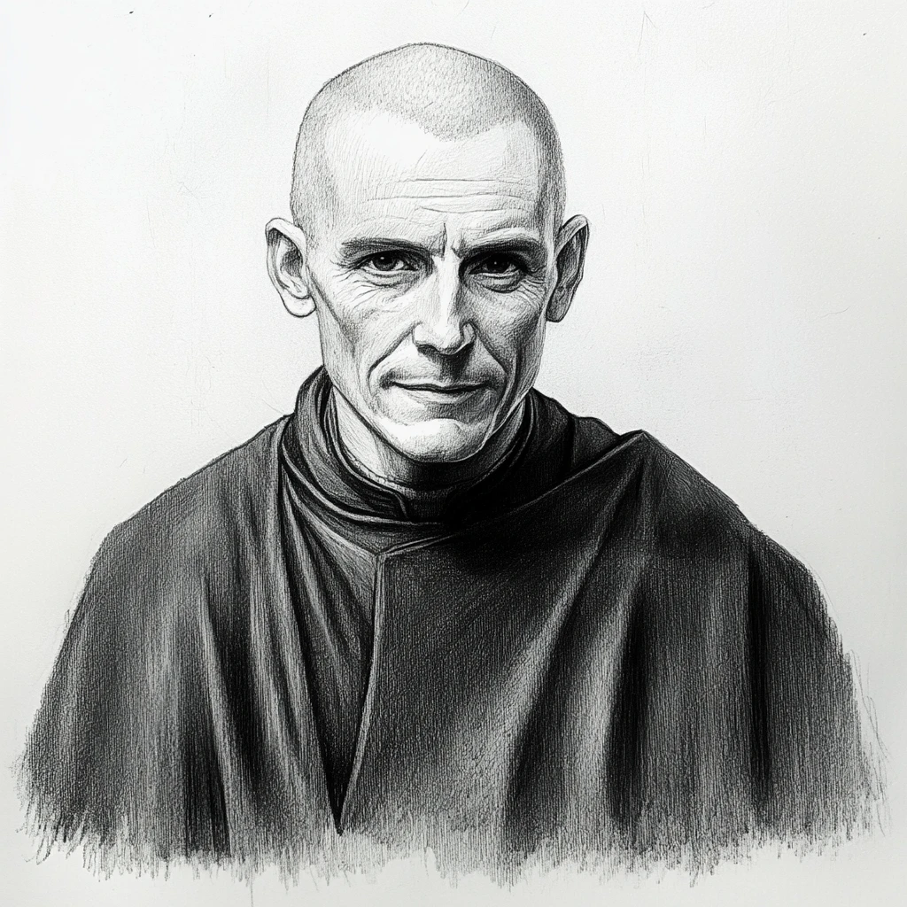

## Das schwarze Auge - Greifenfurter Adel

### Akte des Patienten Abdul al-Hazred ibn Jafar

> **TL;DR**  
> Der wahnsinnige Magier Abdul al-Hazred ibn Jafar, geplagt von Visionen fremder Welten und Mächte, ward in die Obhut eines Boron-Klosters gegeben. Trotz der Bemühungen der Brüder und Schwestern, insbesondere des Abtes Borondrian Dergelmund, verschlimmerte sich sein Zustand stetig. Der Abt, von den Geheimnissen des Magiers besessen, vertiefte sich in dunkle Studien. Am Ende fand man Abdul grausam verstümmelt, doch mit friedvollem Antlitz, während der Abt selbst dem Wahnsinn anheimzufallen droht.

#### 1. Bericht

**Datum:** 12. Tag des Tsa im Jahre 1037 BF  
**Verfasser:** Bruder Theophilus, Archivarius  
**Behandelnde Brüder und Schwestern:** Bruder Alrik, Schwester Liora

---

**Bericht über den Zustand von Abdul al-Hazred ibn Jafar**

An diesem Tage wurde Abdul al-Hazred ibn Jafar in unsere Obhut gebracht. Ein Mann von beeindruckender Herkunft, geboren in den unendlichen Weiten der Wüste Khôm. Seine Herkunft und die Berichte über seine Fähigkeiten als Magier und Gelehrter flößen sowohl Respekt als auch Furcht ein. Seine Augen zeugen von einem Wissen, das tief und fremdartig ist, doch liegt über ihnen der Schleier des Wahnsinns.

Sein Zustand bei der Ankunft war äußerst besorgniserregend. Er sprach wirr und sein Blick war unstet, als würde er Welten sehen, die uns verborgen bleiben. Es schien, als ob sein Geist die Grenzen unserer Welt durchbrochen hätte und nun in einem endlosen Labyrinth gefangen sei.

Unsere ersten Beobachtungen und Gespräche mit Abdul al-Hazred zeigten, dass sein geistiger Zustand äußerst labil ist. Wir befürchten, dass sein Verstand durch den Kontakt mit unbekannten und möglicherweise gefährlichen Mächten schwer beschädigt wurde. Unser vorrangiges Ziel ist es, seinen Geist zu stabilisieren und ihm die notwendige Ruhe und Sicherheit zu bieten, um eine mögliche Heilung zu ermöglichen.

Unsere Gebete zu Boron, dem Herrn der vollkommenen Seelen, sollen ihm die nötige Kraft geben, diese schwere Prüfung zu überstehen. Wir werden weiterhin alles in unserer Macht Stehende tun, um ihm die notwendige Pflege und Unterstützung zukommen zu lassen.

#### 2. Bericht

**Datum:** 5. Tag des Efferd im Jahre 1037 BF  
**Verfasser:** Bruder Augustinus, Nervenheiler  
**Behandelnde Brüder und Schwestern:** Schwester Elara, Bruder Cedric

---

**Bericht über den Zustand von Abdul al-Hazred ibn Jafar**

In den vergangenen Wochen haben wir Abdul al-Hazred ibn Jafar intensiv beobachtet und behandelt. Sein geistiger Zustand bleibt weiterhin äußerst instabil. Der Patient spricht häufig in einem unverständlichen Kauderwelsch, durchsetzt mit Begriffen, die scheinbar aus einer unbekannten Sprache stammen. Worte wie 'Pforten', 'Schlüssel' und 'Sphären' tauchen in seinen Monologen immer wieder auf, was uns zu der Annahme führt, dass diese Begriffe von zentraler Bedeutung für seinen inneren Zustand sind.

Abdul al-Hazreds Augen flackern unruhig, als ob er ständig etwas Unsichtbares verfolgen würde. Er scheint in ständiger Furcht vor unsichtbaren Bedrohungen zu leben. Diese Paranoia erschwert es, einen stabilen Kontakt zu ihm herzustellen und seine Gedanken zu ordnen.

Die körperliche Verfassung des Patienten hat sich durch die regelmäßige Pflege leicht verbessert, jedoch bleibt seine mentale Gesundheit ein großes Anliegen. Wir haben begonnen, ihm Beruhigungsmittel zu verabreichen, um seine extremen Angstzustände zu lindern. Gleichzeitig versuchen wir durch gezielte Gesprächstherapie und spirituelle Betreuung, eine Basis für seine Heilung zu schaffen.

Unsere Gebete zu Boron, dem Herrn der vollkommenen Seelen, sollen ihm die notwendige innere Ruhe und Klarheit bringen. Die Unterstützung der Brüder und Schwestern wird fortgesetzt, um ihm in dieser schweren Zeit beizustehen und seine geistige Verfassung zu stabilisieren.

#### 3. Bericht

**Datum:** 19. Tag des Boron im Jahre 1037 BF  
**Verfasser:** Abt Borondrian Dergelmund  
**Behandelnde Brüder und Schwestern:** Bruder Faelan, Schwester Mara

---

**Bericht über den Zustand von Abdul al-Hazred ibn Jafar**

Mit großem Interesse und nicht minderer Besorgnis habe ich mich den Berichten über unseren Patienten Abdul al-Hazred ibn Jafar gewidmet. Es wurde mir anvertraut, dass dieser Mann in seiner Heimat als ein Gelehrter von immensem Wissen und zugleich als eine Figur von großer Gefahr angesehen wurde. Die Geschichten, die sich um ihn ranken, sind gleichermaßen faszinierend und verstörend.

Die Brüder und Schwestern berichten von unheimlichen Geräuschen und Schreien, die aus seinen Gemächern drangen. Diese nächtlichen Manifestationen seines Wahnsinns sind besonders beunruhigend. Zusätzlich gibt es Berichte über unangenehme Gerüche, die aus der Kammer des verrückten Magiers dringen, deren Ursache jedoch nicht gefunden werden kann.

Bei meinen eigenen Beobachtungen konnte ich feststellen, dass Abdul al-Hazreds Zustand weiterhin äußerst instabil ist. Sein Geist scheint von einer tiefen Zerrüttung gezeichnet zu sein, und seine Augen verraten ein Wissen, das jenseits unserer gewöhnlichen Wahrnehmung liegt. Er spricht oft in Rätseln und benutzt Begriffe, die ich bisher noch nie gehört habe. Es ist, als ob er Zugang zu einer anderen Realität hat, die für uns verborgen bleibt.

Meine Faszination für diesen Mann wird nur durch meine Sorge um seine und unsere Sicherheit übertroffen. Es ist offensichtlich, dass Abdul al-Hazred eine immense Belastung für seinen Geist erlitten hat, die ihn an den Rand des Wahnsinns getrieben hat. Unsere Aufgabe ist es nun, seine geistige Gesundheit zu stabilisieren und die Kräfte zu verstehen, mit denen er zu kämpfen scheint.

Unsere Gebete zu Boron, dem Herrn der vollkommenen Seelen, sollen ihm die nötige Kraft und Klarheit schenken. Wir werden weiterhin mit größter Sorgfalt und Hingabe daran arbeiten, ihm die notwendige Pflege und Unterstützung zukommen zu lassen, in der Hoffnung, dass wir eines Tages das volle Ausmaß seines Wissens und seiner Gefahren begreifen können.

#### 4. Bericht

**Datum:** 2. Tag des Rahjamondes im Jahre 1038 BF  
**Verfasser:** Abt Borondrian Dergelmund  
**Behandelnde Brüder und Schwestern:** Bruder Alrik, Bruder Faelan

---

**Bericht über den Zustand von Abdul al-Hazred ibn Jafar**

Seit der Übernahme des Falls von Abdul al-Hazred ibn Jafar habe ich mich intensiv mit ihm und seinen mysteriösen Äußerungen befasst. Seine Gedanken kreisen unablässig um Sterne, Tore und Schlüssel. Es scheint, als versuche er, einen kosmischen Code zu entschlüsseln, der ihm Zugang zu unermesslichem Wissen oder Wahnsinn verschaffen könnte. Seine Sprache ist oft unverständlich, durchsetzt mit Begriffen und Redewendungen, die tiefes und verborgenes Wissen zu enthalten scheinen.

Meine bisherigen Bemühungen, seinen Zustand zu lindern, haben keine nachhaltige Wirkung gezeigt. Ohne das Verständnis seiner Sprache scheint jede Annäherung an seinen geistigen Zustand zum Scheitern verurteilt. Ich bin überzeugt, dass die Heilung dieses gequälten Geistes nur möglich ist, wenn wir die unverständlichen Worte und Begriffe, die er benutzt, entschlüsseln und verstehen.

In den vergangenen Wochen habe ich meine gesamte Energie und Zeit darauf verwendet, diese mysteriösen Äußerungen zu entschlüsseln. Ich habe mich in die Bibliothek zurückgezogen, alte und obskure Texte durchforscht und selbst die ältesten Schriftrollen des Klosters studiert. Leider ohne allzu großen Erfolg. Einige wenige Worte, jedoch in scheinbar abgewandelter Form, konnte ich in uralten Berichten finden. Wenn ich diese Worte ausspreche, merke ich, dass meine Worte oft von der gleichen Willenskraft durchsetzt sind, die auch der Patient an den Tag legt. Daher werde ich weitere Zeit erübrigen müssen, die ich den Schriften und Manuskripten widme, die möglicherweise den Schlüssel zu Abdul al-Hazreds Heilung enthalten. Leider lenkt mich das Verhalten der Brüder und Schwestern unseres Klosters viel zu häufig ab. So ziehe ich mich nun gelegentlich in meine Kammer zurück, um arbeiten zu können.

Die Behandlung des Magiers gestaltet sich als äußerst schwierig und frustrierend. Trotz meiner intensiven Bemühungen und tiefgehenden Studien scheint sein Zustand sich nicht zu bessern. Abdul al-Hazred verharrt in einem Zustand tiefer geistiger Umnachtung, seine Augen starren oft ins Leere, als ob er etwas sieht, das für uns unsichtbar bleibt. Er murmelt unverständliche Gebete und Beschwörungen, welche es zu analysieren gilt. Sie könnte der Weg zu seiner Heilung sein.

Ich habe weiter versucht, seine Gedankenwelt zu durchdringen, indem ich intensiv mit ihm sprach und versuchte, seine wirren Erzählungen zu ordnen und zu verstehen. Doch jedes Mal, wenn ich glaube, einen Zusammenhang zu erkennen, entgleitet er mir. Es scheint, als ob der Magier in einer anderen Realität gefangen ist, eine Realität, die ihm völlig real erscheint, aber für uns unerreichbar bleibt.

Es ist offensichtlich, dass er glaubt, dass seine Verbindung zu den Sternen, Toren und Schlüsseln mehr als nur metaphorisch ist. Es tut so, als ob er tatsächlich in der Lage ist, diese Konzepte einer fremden Realität zu erleben und zu manipulieren. Dies macht es umso schwieriger, ihn zu behandeln, da seine Realität und unsere so fundamental unterschiedlich sind.

Ich habe überlegt, ob es möglich wäre, durch tieferes Eintauchen in seine Welt und seine Gedanken eine Brücke zu schlagen. Vielleicht gibt es eine Möglichkeit, durch Magie oder Rituale seine Realität zu betreten und von innen heraus zu verstehen und zu heilen. Doch diese Gedanken sind gefährlich und könnten auch meinen eigenen Verstand gefährden.

Meine Bemühungen, Abdul al-Hazreds Zustand zu lindern, haben bisher keine nachhaltige Wirkung gezeigt. Es scheint, als ob die Dunkelheit und das Chaos, die seinen Geist beherrschen, zu tief und zu stark sind, um mit herkömmlichen Mitteln bekämpft zu werden. Aber ich werde nicht aufgeben. Ich werde weiterhin alles in meiner Macht Stehende tun, um die Geheimnisse, die er mit sich bringt, zu lüften und die Rätsel, die seinen Wahnsinn umgeben, zu lösen.

#### 5. Bericht

**Datum:** 14. Tag des Travia im Jahre 1038 BF  
**Verfasser:** Abt Borondrian Dergelmund  
**Behandelnde Brüder und Schwestern:** Bruder Alrik, Schwester Liora

---

**Bericht über den Zustand von Abdul al-Hazred ibn Jafar**

Dank meiner unermüdlichen Studien alter Texte und meiner intensiven Recherchen in den teils abgelegensten Archiven des Klosters konnte ich einen kleinen Fortschritt erzielen. Einige der wirren Worte des wahnsinnigen Magiers beginnen nun mehr Sinn zu ergeben. Diese Fortschritte haben mir ermöglicht, einen besseren Zugang, nicht nur zu dem gequälten Geist des Magiers, zu finden. Die Erkenntnisse, die ich durch meine Forschung gewonnen habe, sind von unschätzbarem Wert und doch sind sie nur ein kleiner Schritt in der Erkenntnis dessen, was Abdul al-Hazred ibn Jafar plagt.

Dieser spricht jetzt, nachdem ich eine vertrauensvolle Bindung zu ihm aufbauen konnte, von den Traumlanden, einer anderen Realität, die aus den Träumen der Menschen geformt ist. Seine Beschreibungen dieser Orte sind detailliert und erschreckend zugleich. Oft erwähnt er eine Entität namens Yog-Sothoth, deren Geheimnisse er angeblich in den Traumlanden ergründet hat.

Meine Arbeit mit Abdul al-Hazred hat meine Aufmerksamkeit und meine Bemühungen voll und ganz in Anspruch genommen, aber diese Studien sind unerlässlich, um die komplexen Zusammenhänge zu verstehen und um eine effektive Behandlung für Abdul al-Hazred entwickeln zu können. Mittlerweile gehe ich davon aus, dass ihn etwas sehr Reales oder besser Irreales plagt.

Die Brüder und Schwestern des Klosters mögen besorgt sein über meine Hingabe, doch sie verstehen nicht das Ausmaß der Bedrohung und des Wissens, das in diesem Fall steckt. Auch haben sie Geräusche und Schreie aus den Gemächern Abdul al-Hazreds gehört und einen unangenehmen Geruch wahrgenommen, dessen Quelle nicht zu identifizieren war. Diese Phänomene sind nicht zufällig; sie sind Indikatoren für die tiefen, unergründlichen Mächte, mit denen wir es zu tun haben.

Ich habe weiterhin intensive Gespräche mit Abdul al-Hazred geführt, versucht, seine Gedankenwelt zu durchdringen und seine wirren Erzählungen zu ordnen. Es ist offensichtlich, dass seine Verbindung zu den Traumlanden und Yog-Sothoth tiefer und komplexer ist als zunächst angenommen. Doch ich bin zuversichtlich, dass meine Forschung und meine Hingabe uns schließlich den Schlüssel zu seinem Geist liefern werden.

Es ist wahr, dass meine Bemühungen bisher keine nachhaltige Wirkung gezeigt haben, doch dies ist kein Grund zur Resignation. Ich bin fest entschlossen, die Geheimnisse zu lüften und die Rätsel zu lösen, die Abdul al-Hazreds Wahnsinn umgeben. Meine Studien und meine Hingabe sind der einzige Weg, um dieses Wissen zu erlangen und dennoch habe ich das Gefühl, nicht weit genug zu gehen.

#### 6. Bericht

**Datum:** 23. Tag des Peraine im Jahre 1039 BF  
**Verfasser:** Abt Borondrian Dergelmund  
**Behandelnde Brüder und Schwestern:** Bruder Alrik, Schwester Mara

---

**Bericht über den Zustand von Abdul al-Hazred ibn Jafar**

Dank meiner unermüdlichen Studien und meiner intensiven Recherchen, durch teils fremde Gebete und Anrufungen, habe ich weitere Erkenntnisse über den Zustand von Abdul al-Hazred ibn Jafar erlangt. Diese neuen Erkenntnisse haben mein Verständnis verbessert, doch sie haben auch neue Fragen aufgeworfen. Fragen, die möglicherweise der Ursprung seines Wahnsinns sein könnten.

Der verrückte Magier spricht nun gelegentlich von falsch angeordneten Sternen und fehlerhaften Sternbildern. Diese falschen Sternbilder könnten Hinweise auf Zugänge zu der fremdartigen Dimension sein, die er angeblich bereist hat. In meinen intensiven Studien habe ich Hinweise auf die von verschobenen Sternbildern gefunden. Abdul al-Hazreds Worte und Beschreibungen passen beängstigend genau zu diesen uralten Berichten.

Die Behandlung des Magiers gestaltet sich weiterhin als äußerst schwierig. Trotz meiner intensiven Bemühungen und der Vertiefung in seine mysteriösen Äußerungen scheint sein Zustand sich nicht zu bessern. Abdul al-Hazred verharrt in einem Zustand tiefer geistiger Umnachtung; seine Augen starren oft ins Leere, als ob er etwas sieht, das für uns unsichtbar bleibt. Er murmelt unverständliche Gebete und Beschwörungen, die scheinbar verborgene Wahrheiten und immense Macht enthalten. Ich bin überzeugt, dass ich ein vollständiges Verständnis dieser fremden Wahrheiten erlangen muss, um ihn zu heilen.

Denn nur das Verstehen der Ursache ermöglicht die Heilung.

In der Nacht seines Todes vernahmen die Brüder und Schwestern einen seltsamen und üblen Geruch aus der Zelle von Abdul al-Hazred, schlimmer als alles, was diesem voranging. Am nächsten Morgen fanden wir ihn leblos auf dem Boden, sein Inneres nach außen gekehrt. Trotz der schrecklichen Szene, die sich den Anwesenden bot, war der friedliche und zufriedene Ausdruck in den Augen des Toten unendlich viel schlimmer und traumatischer. Was auch immer der wahnsinnige Magier erreichen wollte; es war ihm gelungen...

Obwohl meine Bemühungen bisher keine nachhaltige Wirkung gezeigt haben, bin ich entschlossen, die Geheimnisse, die Abdul al-Hazred mit sich bringt, weiter zu erforschen. Es ist offensichtlich, dass die Lösung seiner Rätsel tief in den Sternen verborgen liegt. Nur durch ein tiefes Verständnis dieser fremden Sphäre können wir hoffen, die Wahrheit zu enthüllen und möglicherweise eine Heilung zu finden.

#### 7. Bericht

**Datum:** 5. Tag des Efferd im Jahre 1039 BF  
**Verfasser:** Bruder Alrik, Nervenheiler

---

**Bericht über den Zustand von Abdul al-Hazred ibn Jafar**

Am Morgen des 5. Efferd wurden wir mit einem erschütternden Anblick konfrontiert. Abdul al-Hazred ibn Jafar wurde leblos in seiner Kammer gefunden, sein Inneres grotesk nach außen gekehrt. Der Raum war erfüllt von einem bestialischen Gestank, der wie eine Manifestation des Bösen selbst wirkte. Der Geruch war eine widerwärtige Mischung aus fauligem Verfall und einer unerklärlichen, fast außerirdischen Fäulnis. Der Gestank war so intensiv, dass er unsere Sinne überflutete und die Luft im Raum schwer und unheilvoll machte. Die Quelle dieses Geruchs war nicht nur der Leichnam, sondern schien auch aus den tiefsten Ecken des Raumes zu kommen, als ob die Wände selbst dieses abscheuliche Aroma abgesondert hätten.

Trotz der schrecklichen Szene, die sich uns bot, war der Ausdruck in den Augen des Toten das beunruhigendste Element. Ein unnatürlich friedlicher und zufriedener Blick, der völlig im Widerspruch zu der entsetzlichen Verstümmelung seines Körpers stand. Es war, als ob er im Moment seines Todes eine unbegreifliche Erleuchtung oder Erfüllung erreicht hätte. Die Umstände seines Todes bleiben ein großes Rätsel, das schwer auf unseren Herzen lastet.

Ich muss jedoch auch meine wachsende Sorge um unseren ehemaligen Abt Borondrian Dergelmund ausdrücken. Sein Verhalten weist vielleicht Ähnlichkeiten mit dem des verstorbenen Magiers auf. Er hat sich immer weiter von der Gemeinschaft zurückgezogen, verbringt unzählige Stunden in der Bibliothek und in seiner Kammer, vertieft in alte und mysteriöse Texte. Es ist offensichtlich, dass er tief in seinen Studien versunken ist, doch seine Fixierung auf die wirren Worte und Gedanken von Abdul al-Hazred

### Akte des Patienten Borondrian Dergelmund

> **TL;DR:**  
> Abt Borondrian Dergelmund entwickelte eine Obsession für die Heilung des geisteskranken Magiers Abdul al-Hazred ibn Jafar. Dies führte zu einer zunehmenden Vernachlässigung seiner Pflichten und einer Verschlechterung seiner eigenen geistigen und körperlichen Gesundheit. Trotz des Todes des Magiers und vorübergehender Besserungen verschlechterte sich Borondrians Zustand weiter. Er zog sich immer mehr zurück, litt unter Halluzinationen und wurde zunehmend pflegebedürftig. Schließlich wurde eine Verlegung nach Selem zur intensiveren Behandlung geplant, da sein Zustand kritisch wurde.

#### 1. Bericht

**Datum**: 1. Tag des Rahjamondes im Jahre 1037 BF  
**Verfasser**: Bruder Theophilus, Archivarius  
**Behandelnde Brüder und Schwestern**: Bruder Augustinus, Bruder Antonius

---

**Bericht über den Zustand von Abt Borondrian Dergelmund**

Mit wachsender Besorgnis stelle ich fest, dass unser geschätzter Abt Borondrian Dergelmund in den letzten Monaten zunehmend seine Aufmerksamkeit auf den geistig schwer erkrankten Magier Abdul al-Hazred ibn Jafar gerichtet hat, der seit einiger Zeit in unserer Obhut ist. Diese Fokussierung auf einen einzelnen Patienten hat dazu geführt, dass Borondrian seine Pflichten gegenüber den anderen Patienten vernachlässigt.

Es scheint, dass Borondrian in seiner Bemühung, den gequälten Geist des Magiers zu heilen, sehr viel Zeit in der Bibliothek oder allein in den Gebetsräumen verbringt. Er vertieft sich in alte Bücher sowie intensive Gebete. Seine Gespräche mit den Brüdern und Schwestern thematisieren meist den verrückten Magier, um den seine Gedanken und Sorgen kreisen.

Einige von uns machen sich Sorgen, dass Borondrian unter einer leichten Form der Überarbeitung leidet. Sein Engagement und seine Hingabe an die Heilung des Magiers sind unbestreitbar, doch befürchten wir, dass er dabei seine eigenen Grenzen überschreitet. Um ihn zu entlasten und eine mögliche Erschöpfung zu vermeiden, haben wir beschlossen, ihn vorübergehend von den meisten seiner alltäglichen Aufgaben zu entbinden. Dies ermöglicht ihm, sich weiterhin intensiv um Abdul al-Hazred zu kümmern.

Unsere Gebete zu Boron, dem Ewigen, sollen ihm die Kraft geben, diese schwere Prüfung zu überwinden. Wir alle hoffen auf seine baldige Erholung und seine Rückkehr zu der mitfühlenden und weisen Führungsperson, die er einst war. In der Zwischenzeit werden wir sicherstellen, dass sowohl er als auch die anderen Patienten die notwendige Pflege und Aufmerksamkeit erhalten.

#### 2. Bericht

**Datum**: 15. Tag des Firunmondes im Jahre 1037 BF  
**Verfasser**: Bruder Augustinus, Nervenheiler  
**Behandelnde Brüder und Schwestern**: Novizin Boronike, Bruder Antonius

---

**Bericht über den Zustand von Abt Borondrian Dergelmund**

Die Situation von Abt Borondrian Dergelmund hat sich in den letzten sechs Monaten nur wenig verbessert. Obwohl er weiterhin unermüdlich daran arbeitet, den geistig schwer erkrankten Magier Abdul al-Hazred ibn Jafar zu heilen, zeigt sich, dass Borondrians Engagement eine zunehmende Belastung für seine eigene Gesundheit darstellt.

Borondrian nimmt nur noch selten an den gemeinsamen Gottesdiensten und Gebeten teil, die zu Ehren des Ewigen abgehalten werden. Stattdessen verbringt er den Großteil seiner Zeit in der Bibliothek, vertieft in alte und mystische Texte, oder in den Gebetsräumen, wo er sich intensiv mit Gebeten beschäftigt. Seine Gespräche mit den Brüdern und Schwestern drehen sich fast ausschließlich um seine Sorgen und Bemühungen bezüglich Abdul al-Hazred, was bei vielen von uns Besorgnis hervorruft.

Einige von uns befürchten, dass Borondrian unter einer Form von Kraftverzehr und Geistesschwund leidet. Seine Hingabe an die Heilung des Magiers ist bewundernswert, doch sie scheint ihn an seine eigenen Grenzen zu bringen. Wir haben beschlossen, ihn weiterhin von den meisten seiner alltäglichen Aufgaben zu entbinden, um ihn zu entlasten und eine mögliche Erschöpfung zu vermeiden.

Unsere Gebete zu Boron, dem Greisen Gott, sollen ihm die Kraft geben, diese schwere Prüfung zu überstehen. Wir hoffen, dass er bald zu seiner alten Stärke und Weisheit zurückfindet. In der Zwischenzeit werden wir sicherstellen, dass sowohl er als auch die anderen Patienten die notwendige Pflege und Aufmerksamkeit erhalten.

#### 3. Bericht

**Datum**: 1. Tag des Rondramondes im Jahre 1038 BF  
**Verfasser**: Bruder Hieronymus, Chronist des Klosters  
**Behandelnde Brüder und Schwestern**: Bruder Kaspar, Bruder Antonius

---

**Bericht über den Zustand von Abt Borondrian Dergelmund**

In den letzten Monaten hat sich der Zustand von Abt Borondrian Dergelmund weiter verschlechtert. Er nimmt nur noch selten an den täglichen Gebeten und Gottesdiensten teil, die zu Ehren des Schweigsamen abgehalten werden. Stattdessen verbringt er den Großteil seiner Zeit in der Bibliothek oder seiner Kammer. Gelegentlich sieht man ihn, wie er durch die abgelegenen und verlassenen Teile des Klosters wandert.

Seine Gespräche mit den Brüdern und Schwestern werden immer seltener und sind meist nur kurz. Er zeigt eine zunehmende Fixierung auf Abdul al-Hazred ibn Jafar. Diese Fixierung und seine Isolation führen zu wachsender Besorgnis unter den Brüdern und Schwestern des Klosters.

Wir befürchten, dass Borondrian unter einer schweren geistigen und körperlichen Erschöpfung leidet. Seine Hingabe an die Heilung des Magiers ist bewundernswert, aber sie scheint seine eigenen Grenzen zu überschreiten. Um seine Genesung zu unterstützen, haben wir beschlossen, ihn weiterhin von den meisten seiner alltäglichen Aufgaben zu entbinden und ihm so viel Ruhe wie möglich zu ermöglichen. Unsere Bitten, die Arbeit mit dem verrückten Magier ruhen zu lassen, verweigert er sich kategorisch.

Unsere Gebete zu Boron, dem Ewigen, sollen ihm die Kraft geben, diese schwere Prüfung zu überstehen. Wir hoffen, dass er bald zu seiner alten Stärke und Weisheit zurückfindet. In der Zwischenzeit werden wir sicherstellen, dass sowohl er als auch die anderen Patienten die notwendige Pflege und Aufmerksamkeit erhalten.

#### 4. Bericht

**Datum**: 15. Tag des Peraine im Jahre 1038 BF  
**Verfasser**: Bruder Kaspar, Nervenheiler  
**Behandelnde Brüder und Schwestern**: Bruder Hieronymus, Bruder Antonius

---

**Bericht über den Zustand von Abt Borondrian Dergelmund**

Im aktuellen Behandlungszeitraum hat sich die Situation von Abt Borondrian Dergelmund weiter zugespitzt. Er hat fast vollständig aufgehört, an den täglichen Ritualen und Pflichten des Klosters teilzunehmen. Seine Isolation ist so ausgeprägt, dass er nur noch selten außerhalb der Bibliothek oder seiner Kammer gesehen wird. Gelegentlich wandert er durch die verlassenen Teile des Klosters, doch auch diese Momente werden seltener.

Seine Gespräche mit den Brüdern und Schwestern des Klosters sind fast vollständig verstummt. Wenn er spricht, sind seine Worte oft kurz und er wirkt stark abgelenkt. Die Fixierung auf Abdul al-Hazred ibn Jafar hat weiter zugenommen und dominiert seine Gedanken und Handlungen. Er wirkt oft gereizt, wenn man versucht, ihn von seiner Arbeit mit dem verrückten Magier abzubringen.

Borondrians körperliche Verfassung hat sich ebenfalls verschlechtert. Er wirkt müde, abgemagert und zeigt Anzeichen von Erschöpfung. Die Sorge unter den Brüdern und Schwestern wächst, da seine Hingabe an die Heilung des Magiers ihn offenbar völlig verzehrt. Unsere wiederholten Bitten, die Arbeit mit dem Magier ruhen zu lassen und sich zu erholen, lehnt er weiterhin ab.

Wir haben beschlossen, ihn von allen seinen Aufgaben zu entbinden, um ihm die notwendige Ruhe und Erholung zu ermöglichen. Unsere Gebete zu Boron, dem Herrn der Letzten Dinge, sollen ihm die Kraft geben, diese schwere Prüfung zu überstehen. Wir hoffen, dass er bald zu seiner alten Stärke und Weisheit zurückfindet. In der Zwischenzeit werden wir sicherstellen, dass sowohl er als auch die anderen Patienten die notwendige Pflege und Aufmerksamkeit erhalten.

#### 5. Bericht

**Datum**: 1. Tag des Ingerimm im Jahre 1039 BF  
**Verfasser**: Bruder Antonius, Gelehrter des Klosters  
**Behandelnde Brüder und Schwestern**: Bruder Augustinus, Schwester Kalina

---

**Bericht über den Zustand von Abt Borondrian Dergelmund**

Seit dem letzten Bericht hat sich der Zustand von Abt Borondrian Dergelmund weiter verschlechtert. Aufgrund seiner anhaltenden körperlichen und geistigen Erschöpfung haben wir beschlossen, ihn offiziell als Patienten zu anerkennen. Dies war eine schwere Entscheidung, aber notwendig, um ihm die notwendige Ruhe und Fürsorge zukommen zu lassen.

Kalina Niodas hat nun offiziell das Amt des Abtes übernommen, um die Führung des Klosters sicherzustellen und Borondrian die Möglichkeit zu geben, sich vollständig auf seine Genesung zu konzentrieren. Diese Entscheidung wurde von allen Brüdern und Schwestern des Klosters unterstützt.

Borondrian verbringt den Großteil seiner Zeit entweder in der Bibliothek, vertieft in seine Studien, oder einsam in den alten Gebetsräumen des Klosters. Seine Isolation und die anhaltende Fixierung auf die Schriften und Rituale zur Heilung des Magiers Abdul al-Hazred ibn Jafar haben zu einer deutlichen Verschlechterung seines physischen und psychischen Zustands geführt.

Unsere Gebete zu Boron, dem Herrn der vollkommenen Seelen, sollen ihm die Kraft geben, diese schwere Prüfung zu überstehen. Wir alle hoffen, dass er bald zu seiner alten Stärke und Weisheit zurückfindet. In der Zwischenzeit werden wir sicherstellen, dass sowohl er als auch die anderen Patienten die notwendige Pflege und Aufmerksamkeit erhalten.

#### 6. Bericht

**Datum**: 15. Tag des Rahjamondes im Jahre 1039 BF  
**Verfasser**: Bruder Augustinus, Nervenheiler  
**Behandelnde Brüder und Schwestern**: Bruder Antonius, Schwester Kalina

---

**Bericht über den Zustand von Abt Borondrian Dergelmund**

Im aktuellen Behandlungszeitraum hat sich die Situation im Kloster dramatisch verändert. Der Tod des geistig schwer erkrankten Magiers Abdul al-Hazred ibn Jafar hat tiefe Spuren bei Abt Borondrian Dergelmund hinterlassen. Obwohl dieser Verlust eine schwere Belastung darstellt, zeigt sich in Borondrians Verhalten eine leichte Besserung.

Borondrian hat begonnen, gelegentlich wieder an gemeinsamen Mahlzeiten, Gebeten und Gottesdiensten teilzunehmen. Diese Teilnahme, obwohl nicht regelmäßig, zeigt, dass er zumindest zeitweise wieder Kontakt zu den Brüdern und Schwestern des Klosters sucht. Seine Gespräche mit uns nehmen wieder zu, obwohl sie oft ein wenig wirr und unzusammenhängend erscheinen. Es ist jedoch ein Hoffnungsschimmer, dass er versucht, sich wieder in das klösterliche Leben zu integrieren.

Trotz dieser positiven Anzeichen bleibt Borondrian in einer großen geistigen Belastung gefangen. Seine Fixierung auf die Heilung des verstorbenen Magiers hat tiefe Spuren hinterlassen, die nicht so leicht zu heilen sind. Wir hoffen, dass die wiederaufgenommenen sozialen Kontakte und die Teilnahme an den klösterlichen Aktivitäten ihm helfen werden, seine geistige Gesundheit weiter zu stabilisieren.

Unsere Gebete zu Boron, dem Herrn der Letzten Dinge, sollen ihm weiterhin die Kraft geben, diese schwere Prüfung zu überstehen. Wir alle hoffen, dass er sich von diesem Verlust erholen kann und zu seiner alten Stärke und Weisheit zurückfindet. In der Zwischenzeit werden wir sicherstellen, dass sowohl er als auch die anderen Patienten die notwendige Pflege und Aufmerksamkeit erhalten.

#### 7. Bericht

**Datum**: 1. Tag des Rondramondes im Jahre 1040 BF  
**Verfasser**: Bruder Hieronymus, Chronist des Klosters  
**Behandelnde Brüder und Schwestern**: Novizin Boronike, Bruder Antonius

---

**Bericht über den Zustand von Abt Borondrian Dergelmund**

Im aktuellen Behandlungszeitraum zeigt sich der Zustand von Abt Borondrian Dergelmund weiterhin als wechselhaft. Es gibt Tage, an denen er sich etwas stabiler zeigt, doch ebenso gibt es Phasen tiefer Erschöpfung und geistiger Verwirrung.

Borondrian nimmt gelegentlich wieder an Gottesdiensten teil, was ein positiver Schritt ist. Diese Teilnahme ist jedoch sporadisch und scheint stark von seinem momentanen Zustand abhängig zu sein. Häufig sieht man ihn in den Gebetsräumen, wo er unverständliche Gebete murmelt, als ob er mit einer anderen Welt in Kontakt stünde.

Die Gespräche mit den Brüdern und Schwestern des Klosters sind ebenfalls nur gelegentlich und oft kurz. Es fällt auf, dass er ein scheinbares Vertrauensverhältnis zu Novizin Boronike entwickelt hat, die sich besonders um seine Pflege kümmert. Ihre Anwesenheit scheint ihm ein gewisses Maß an Ruhe und Stabilität zu geben.

Körperlich zeigt Borondrian weiterhin Schwäche, doch es gibt leichte Verbesserungen durch regelmäßiges Essen, welches ihm von Novizin Boronike verabreicht wird. Diese kleinen Fortschritte geben uns einen Funken Hoffnung, dass er sich mit der Zeit weiter erholen könnte.

Unsere Gebete zu Boron, dem Meister der Rätsel und Mysterien, sollen ihm weiterhin die Kraft geben, diese schwere Prüfung zu überstehen. Wir hoffen, dass die Betreuung durch Novizin Boronike und die Gemeinschaft des Klosters ihm den nötigen Halt geben, um seine geistige und körperliche Gesundheit zu stabilisieren.

#### 8. Bericht

**Datum**: 15. Tag des Peraine im Jahre 1040 BF  
**Verfasser**: Bruder Kaspar, Nervenheiler  
**Behandelnde Brüder und Schwestern**: Bruder Hieronymus, Bruder Antonius

---

**Bericht über den Zustand von Abt Borondrian Dergelmund**

Seit dem letzten Bericht ist eine deutliche Verschlechterung im Zustand von Abt Borondrian Dergelmund zu beobachten. Seine geistige Klarheit nimmt wieder ab, und er zieht sich immer häufiger in die Isolation zurück. Dies äußert sich in einem verstärkten Rückzug in seine Kammer und den alten Gebetsräumen des Klosters.

Vermehrt zeigt Borondrian Ausbrüche von Unruhe und Gereiztheit, was das Zusammenleben im Kloster erschwert. Seine geistige Belastung scheint unerträglich zu werden, und die Hoffnung auf eine langfristige Besserung schwindet zunehmend. Die Brüder und Schwestern berichten von nächtlichen Schreien aus seiner Kammer, was auf Albträume oder innere Qualen hinweisen könnte.

Er verbringt seine Tage und Nächte vertieft in das Studium alter Bücher, als suche er verzweifelt nach einer Antwort oder Erlösung. Diese obsessive Beschäftigung mit den alten Schriften und Ritualen verstärkt unsere Besorgnis um seine geistige Gesundheit.

Unsere Gebete zu Boron, dem Unergründlichen, sollen ihm weiterhin die Kraft geben, diese schwere Prüfung zu überstehen. Die Gemeinschaft des Klosters bemüht sich weiterhin, ihm den nötigen Halt und die notwendige Pflege zu bieten, in der Hoffnung, dass er eines Tages zu seiner alten Stärke und Weisheit zurückfinden wird.

#### 9. Bericht

**Datum**: 1. Tag des Ingerimm im Jahre 1041 BF  
**Verfasser**: Bruder Antonius, Gelehrter des Klosters  
**Behandelnde Brüder und Schwestern**: Novizin Boronike, Schwester Kalina

---

**Bericht über den Zustand von Abt Borondrian Dergelmund**

Im aktuellen Behandlungszeitraum hat sich der Zustand von Abt Borondrian Dergelmund weiter verschlechtert. Der Patient zeigt Anzeichen extremer geistiger und körperlicher Erschöpfung und reagiert kaum noch auf Ansprache. Er verbringt die meiste Zeit in völliger Isolation und Rückzug in sich selbst.

In den letzten Monaten wurde Borondrian mehrmals tagelang im Kloster nicht gefunden, was uns dazu zwang, ihn in seiner Kammer einzusperren, um seine Sicherheit zu gewährleisten. Seine mentale Verfassung ist so fragil, dass er kaum noch in der Lage ist, auf seine Umgebung zu reagieren.

Aufgrund seines kritischen Zustands planen wir eine Verlegung nach Selem zur intensiveren Behandlung. Wir hoffen, dass die erfahrenen Heiler dort ihm helfen können, seine geistige Gesundheit wiederherzustellen.

Unsere Gebete zu Boron, dem Herrn der vollkommenen Seelen, sollen ihm die nötige Kraft geben, diese schwere Prüfung zu überstehen. Wir werden weiterhin alles in unserer Macht Stehende tun, um ihm die notwendige Pflege und Unterstützung zukommen zu lassen.

#### 10. Bericht

**Datum**: 15. Tag des Hesinde im Jahre 1043 BF  
**Verfasser**: Schwester Kalina Niodas, Äbtissin  
**Behandelnde Brüder und Schwestern**: Novizin Boronike, Bruder Augustinus

---

**Bericht über den Zustand von Abt Borondrian Dergelmund**

Der Zustand von Abt Borondrian Dergelmund hat sich weiter verschlechtert. Er befindet sich in einem sehr schlechten gesundheitlichen Zustand und ist vollständig auf die Pflege durch Novizin Boronike und die Brüder des Klosters angewiesen. Seine geistige und körperliche Verfassung ist so besorgniserregend, dass wir uns entschieden haben, die Verlegung nach Selem vorzubereiten.

Wir hoffen, dass die erfahrenen Heiler und Therapeuten am Hauptsitz der Noioniten in Selem ihm die dringend benötigte Hilfe bieten können. Die Verlegung wird mit größter Sorgfalt geplant, um sicherzustellen, dass Borondrian während des Transports und der Behandlung bestmöglich versorgt wird.

Unsere Gebete zu Boron, dem Herrn der vollkommenen Seelen, sollen ihm die nötige Kraft geben, diese schwere Prüfung zu überstehen. Wir werden weiterhin alles in unserer Macht Stehende tun, um ihm die notwendige Pflege und Unterstützung zukommen zu lassen.

#### 11. Bericht

**Datum**: 1. Tag des Rondramondes im Jahre 1042 BF  
**Verfasser**: Bruder Hieronymus, Chronist des Klosters  
**Behandelnde Brüder und Schwestern**: Novizin Boronike, Bruder Antonius

---

**Bericht über den Zustand von Abt Borondrian Dergelmund**

Seit dem letzten Bericht hat sich der Zustand von Abt Borondrian Dergelmund weiter verschlechtert. Seine geistige und körperliche Verfassung sind in einem besorgniserregenden Zustand. Borondrian muss nun regelmäßig gefüttert werden, da er selbst dazu nicht mehr in der Lage ist. Auch die Vernachlässigung seiner Körperpflege ist offensichtlich, was eine intensive Betreuung durch Novizin Boronike notwendig macht.

Seine Fixierung auf alte und unbekannte Gebete sowie Anrufungen hat zugenommen. Er verbringt viel Zeit in den alten und abgelegenen Gewölben des Klosters, wo er in einer für uns unverständlichen Sprache Gebete murmelt. Diese Rituale sind uns fremd und verstärken die Besorgnis um seinen geistigen Zustand.

Unsere Gebete zu Boron, dem Herrn der vollkommenen Seelen, sollen ihm die Kraft geben, diese schwere Prüfung zu überstehen. Wir hoffen weiterhin auf seine Genesung, auch wenn die Zeichen zunehmend düster erscheinen.

#### 12. Bericht

**Datum**: 15. Tag des Peraine im Jahre 1042 BF  
**Verfasser**: Bruder Kaspar, Nervenheiler  
**Behandelnde Brüder und Schwestern**: Novizin Boronike, Bruder Antonius

---

**Bericht über den Zustand von Abt Borondrian Dergelmund**

Seit dem letzten Bericht ist der Zustand von Abt Borondrian Dergelmund weiterhin besorgniserregend. Er nimmt kaum noch am klösterlichen Leben teil und ist vollständig auf die Pflege durch Novizin Boronike angewiesen, da er sich selbst nicht mehr versorgen kann. Seine geistige und körperliche Erschöpfung sind offensichtlich und schwerwiegend.

Borondrian verbringt die meiste Zeit in seiner Kammer oder in den abgelegenen Teilen des Klosters, wo er oft in sich gekehrt und teilnahmslos wirkt. Gespräche mit ihm sind selten und meist zusammenhangslos. Die Hoffnung auf eine Besserung seines Zustands ist nahezu aufgegeben worden.

Unsere Gebete zu Boron, dem Herrn der Letzten Dinge, sollen ihm die Kraft geben, diese schwere Prüfung zu überstehen. Wir werden weiterhin alles in unserer Macht Stehende tun, um ihm die notwendige Pflege und Unterstützung zukommen zu lassen, auch wenn die Zeichen zunehmend düster erscheinen.

#### 13. Bericht

**Datum**: 1. Tag des Ingerimm im Jahre 1043 BF  
**Verfasser**: Bruder Antonius, Gelehrter des Klosters  
**Behandelnde Brüder und Schwestern**: Novizin Boronike, Schwester Kalina

---

**Bericht über den Zustand von Abt Borondrian Dergelmund**

Im aktuellen Behandlungszeitraum hat sich der Zustand von Abt Borondrian Dergelmund auf besorgniserregende Weise weiter verschlechtert. Der Patient zeigt Anzeichen extremer geistiger und körperlicher Erschöpfung und reagiert kaum noch auf Ansprache. Er verbringt die meiste Zeit in völliger Isolation und Rückzug in sich selbst.

In den letzten Monaten wurde Borondrian mehrmals tagelang im Kloster nicht gefunden, was uns dazu zwang, ihn in seiner Kammer einzusperren, um seine Sicherheit zu gewährleisten. Seine mentale Verfassung ist so fragil, dass er kaum noch in der Lage ist, auf seine Umgebung zu reagieren.

Aufgrund seines kritischen Zustands planen wir eine Verlegung nach Selem zur intensiveren Behandlung. Wir hoffen, dass die erfahrenen Heiler dort ihm helfen können, seine geistige Gesundheit wiederherzustellen.

Unsere Gebete zu Boron, dem Herrn der vollkommenen Seelen, sollen ihm die nötige Kraft geben, diese schwere Prüfung zu überstehen. Wir werden weiterhin alles in unserer Macht Stehende tun, um ihm die notwendige Pflege und Unterstützung zukommen zu lassen.

#### 14. Bericht

**Datum**: 15. Tag des Hesinde im Jahre 1043 BF  
**Verfasser**: Schwester Kalina Niodas, Äbtissin  
**Behandelnde Brüder und Schwestern**: Novizin Boronike, Bruder Augustinus

---

**Bericht über den Zustand von Abt Borondrian Dergelmund**

Der Zustand von Abt Borondrian Dergelmund hat sich weiter verschlechtert. Er befindet sich in einem sehr schlechten gesundheitlichen Zustand und ist vollständig auf die Pflege durch Novizin Boronike und die Brüder des Klosters angewiesen. Seine geistige und körperliche Verfassung ist so besorgniserregend, dass wir uns entschieden haben, die Verlegung nach Selem vorzubereiten.

Wir hoffen, dass die erfahrenen Heiler und Therapeuten am Hauptsitz der Noioniten in Selem ihm die dringend benötigte Hilfe bieten können. Die Verlegung wird mit größter Sorgfalt geplant, um sicherzustellen, dass Borondrian während des Transports und der Behandlung bestmöglich versorgt wird.

Unsere Gebete zu Boron, dem Herrn der vollkommenen Seelen, sollen ihm die nötige Kraft geben, diese schwere Prüfung zu überstehen. Wir werden weiterhin alles in unserer Macht Stehende tun, um ihm die notwendige Pflege und Unterstützung zukommen zu lassen.
