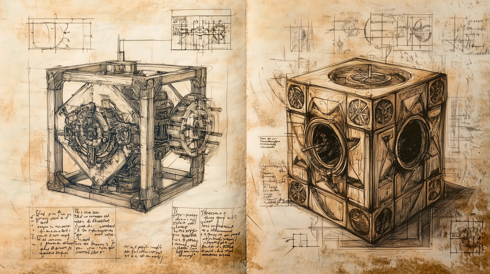

## Das schwarze Auge - 54. Runde der Kampagne: Greifenfurter Adel

Es regnete, als wir nach etwa eineinhalb Tagen auf See im Hafen von Khunchom anlegten. Wir hatten kaum das Schiff verlassen, als Gray von einem aufgeweckten jungen Mann angesprochen wurde, der ihm eine Karte der Stadt verkaufen wollte. Er verlangte einen stolzen Preis und ich glaube, dass er uns da übers Ohr gehauen hatte, aber da wir die Stadt nicht kannten, zahlte Gray nach einer zähen Verhandlung die verlangte Summe.

Bis auf Boronep ließen wir uns im Hotel Erhabener Mhanadi, dem besten Haus der Stadt, nieder. Boronep hingegen entschied sich für die Herberge Zum Tanzenden Kamel. Noch am selben Abend berieten Andaryn, Gray, Link und ich bei einem guten Essen, wie wir vorgehen könnten. Immerhin wurde für Boronep die Zeit langsam knapp. Wenn er über Land zurück nach Ragath reisen wollte, müsste er durch die Wüste Gor und über den Raschtulswall. Dies würde ihn, bei leichtem Gepäck und mit einem schnellen Pferd, vermutlich drei Wochen kosten. Die Tatsache, dass er nur einen Esel besaß, wollte ich gar nicht in meine Überlegungen einbeziehen. Zur Not würden wir ein Pferd kaufen. Das Problem war, dass wir, wenn wir diese Reisezeit berücksichtigen, nur noch fünf Tage hatten, um den Auftrag, den uns Karlos Jurios gegeben hatte, zu erledigen. Somit blieben uns nur noch der Erdstag und der Markttag, um herauszufinden, wo sich diese ominöse Universität befand.

Wenn dies nicht gelänge, wäre unsere einzige Möglichkeit, Boronep schon einmal Richtung Ragath losreiten zu lassen und, sollte uns die Erfüllung des Auftrags gelungen sein, einen Beilunker Reiter mit einem Eilbrief hinterherzuschicken. Da dies nicht unsere einzige Alternative bleiben durfte, beschlossen wir, dass wir bei den Artefakt-Magiern in der Drachenei-Akademie um Hilfe bitten würden. Immerhin hatten wir mehrere Gründe, diese ehrwürdige Anstalt zu besuchen.

Noch am selben Abend machten wir uns gemeinsam mit Boronep auf den Weg zur Akademie. Der Umstand, dass Gray und ich ausgebildete Magier waren, öffnete uns die Türen und zu einem großen Erstaunen verwies man uns direkt an ihre Spektabilität Ashtarra Okharim und die Magistra spectabilitas befasste sich tatsächlich mit unseren Anliegen.

Sie führte eine erste Untersuchung des Armbandes durch, wobei sie einen dämonischen Einfluss feststellen konnte. Außerdem ließ die magische Aura erahnen, dass sich das Schmuckstück auch nicht mit Gewalt abnehmen lässt. Weiter Untersuchungen und Analysen, wie beispielsweise die Bestimmung der Domäne oder gar des betreffenden Dämons würden jedoch ein magisches Ritual erfordern. Diese wäre für einen Versuch, Boronep von dem Armband zu befreien, jedoch unerlässlich. Die nötigen Rituale würden jedoch den akademischen Betrieb und anderen Tätigkeiten an der Drachenei-Akademie empfindlichst beeinflussen. Da meine Kameraden jedoch auf eine einfache Lösung drängten, empfahl sie uns, den Praios-Tempel um Hilfe zu bitten, was wir dankend ablehnten. So verblieben wir damit, dass wir Boronep zunächst einmal der Akademie überantworteten, damit man in einem gewissen Rahmen schon einmal mit Voruntersuchungen beginnen konnte.

Wir zeigten ihr auch den Schuldschein, den wir bei dem Toten in der Höhle unterhalb des alten Turms gefunden hatten. Diese konnte sie anhand einiger der Symbole und Stempel tatsächlich der Akademie zuordnen. Allerdings war er wohl sehr alt und die Magistra spectabilitas erbat sich mehr Zeit.

Als wir die Drachenei-Akademie am nächsten Tag kurz nach der Mittagsstunde wieder besuchten, erfuhren wir mehr. Die Magistra spectabilitas Ashtarra Okharim, konnte bestätigen, dass dieser Schuldschein zu Zeiten ihres Urgroßvaters Zakhaban Okharim al'Amulsahib, vor etwa 150 Jahren, ausgestellt wurde. Aziru ben Melahath ai Beni Shadif, der damalige Schatzmeister der Akademie, beauftragte den Archäologen und Abenteurer Hassan y ben Khorim Al'jamila mit der Bergung eines Artefakts. Allerdings wollte sie uns nicht mehr sagen, ohne dass wir uns nicht in einem besonderen Maße als vertrauenswürdig erwiesen hätten. Dieses Vertrauen könnten wir aber durch die Untersuchung des Einsturzes einer Straße erarbeiten. Dieser Einsturz war erst vor wenigen Stunden erfolgt und schuf einen Zugang zur Kanalisation unterhalb der Stadt. Auch wenn dies erst vor wenigen Stunden geschehen war, gab es bereits Gerüchte im entsprechenden Stadtviertel, dass etwas Unheimliches dort unten war und dass es heraufkam.

Zusammen mit einem Studioso der Akademie, der uns den Weg zeigte, brachen wir auf. Die Wachen der Stadt hatten die Straße bereits abgeriegelt und bewaffnete Männer in der Nähe des Einbruchs postiert. Mit einem Seil, das wir an einem Karren anbanden, ließen wir uns in die Kanalisation hinab. Es stank fürchterlich und in der Dunkelheit konnten wir Bewegungen erkennen. Während Gray eine Fackel entzündete, nutzte ich die Magie meines Stabes, um die Umgebung zu beleuchten. Wir sahen große Reptilien, sogenannte Alligatoren, in deren Revier wir in unserer Unwissenheit eingedrungen waren.

Die Tiere waren zäh und nur mit viel Mühe konnten wir ihre Angriffe abwehren. Wir schlugen etwa ein halbes Dutzend in die Flucht und erlegten Zwei. Doch auch wenn diese Alligatoren furchteinflößend waren, so glaubte ich nicht, dass sie der Auslöser für die wilden Gerüchte waren, die es gegeben hatte. Daher hielt ich meine Kameraden an, trotz des Gestanks und der Gefahr weiter Ausschau zu halten.

Durch eine Röhre gelangten wir in einem Raum, in dem Gray einen Unelementargeist des Unhumus entdeckte. Hierbei handelte es sich um eine pervertierte und verschmutzte Form eines Elementars. In einem gemeinsamen Kraftakt und unter Aufbringung unserer letzten Reserven gelang es uns, diese Monstrosität vom Antlitz Deres zu tilgen.

Wir sammelten einige Proben als Beweis und machten uns auf den Rückweg zur Drachenei-Akademie. Dies jedoch nicht ohne vorher einige unserer Kleidungsstücke zu verbrennen, ein ausführliches Bad zu nehmen und uns auf dem Basar neu einzudecken.

Nachdem wir von unserer Entdeckung berichtet hatten, erhielten wir mehr Informationen zum so lange gesuchten Artefakt. Bei diesem handelte sich um eine Art mechanisches Rätsel in Form eines Würfels mit vier Kammern. Wir erhielten die Kopien von zwei Seiten mit Zeichnungen und Notizen zu dem Artefakt. Diese sind jedoch in Ur-Tulamidya und scheinen obendrein in einer Art Rätsel oder Geheimsprache verfasst zu sein.

