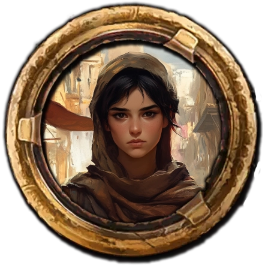

## Das schwarze Auge - 55. Runde der Kampagne: Greifenfurter Adel

Das schwarze Auge – 55. Runde der Kampagne: Greifenfurter Adel
Boronep war noch immer in der Obhut der Collega Drachenei-Akademie. Daher freuten wir uns umso mehr, als Stordian zu uns stieß. Nach allem, was wir bislang in Khunchom erlebt hatten, war ein starker Schwertarm für uns ein Segen. Der Geist des Unerzes, den wir in der Kanalisation besiegt hatten, musste irgendwo herkommen. Solche widerwärtigen Abscheulichkeiten entstehen selten aus dem Nichts.

Aber wir mussten auch noch diese sogenannte „Universität“ finden – und langsam ging uns die Zeit aus. Bei einem gemeinsamen Frühstück besprachen wir uns. Wir gingen davon aus, dass unsere beste Chance darin bestünde, uns am Hafen oder auf dem Basar umzuhören. Stordian schlug uns jedoch vor, uns zuerst in der Nähe der Tempel der Stadt nach versteckten Zeichen und Hinweisen umzusehen. Damit verbrachten wir den gesamten Vormittag.

Schließlich trieben uns Hunger und erfolglose Suche doch zum Basar. Dort ließen wir uns auf einer Dachterrasse nieder und genossen eine Tasse Tee. Als Gray sich schließlich an einem Stand mit köstlichen Backwaren ein Brot kaufen wollte, kam ein kleiner Junge zum Betteln. Grays weiches Herz veranlasste ihn, dem Kind ebenfalls ein Brot zu kaufen – und gerade als er sich zu dem Jungen herunterbeugte, stürmte eine ganze Schar Kinder heran und umzingelte meinen Freund. Dutzende kleiner Hände schoben sich unter seine Gewänder und in seine Taschen, bis – auf ein geheimes Zeichen, mit dem die Bande davonrannte – alles seinen Lauf nahm. Zum Glück konnten wir von der Dachterrasse aus erkennen, wohin die Kinder liefen, und folgten ihnen zu einem heruntergekommenen Haus, das nur wenige Meter vom Marktplatz entfernt lag.

Im Keller des Hauses fanden wir die Kinder – sowohl jene, die es gewagt hatten, Gray zu bestehlen, als auch einige, die tatsächlich noch sehr jung waren. Die Jüngsten waren höchstens drei Jahre alt. Meine Kameraden versuchten beruhigend auf die ängstlichen Straßenkinder einzureden, um sie dazu zu bringen, Grays Eigentum herauszugeben, doch es wollte nicht gelingen. Die Bande sah aus, als ob sie schon seit Tagen nichts Anständiges zu essen gehabt hätte, und einige der Kleinen wirkten offensichtlich sehr krank.

Es war eine Mischung aus Angst und der Tatsache, dass Gray in einer fremden Sprache auf sie einredete, die die Situation immer weiter verschlimmerte. Selbst Andary, der im Tulamidya mächtig war, konnte die weinenden Kinder nicht beruhigen. Dennoch wollten wir den Kleinen helfen, also versuchten wir es weiter – ohne zu bemerken, dass sich jemand von hinten an uns herangeschlichen hatte. Ein dürres Mädchen von höchstens dreizehn oder vierzehn Jahren hielt einen alten Dolch in der Hand und forderte uns in gebrochenem Garethi auf, von den Kleinen abzulassen.

Mit viel Geduld und einigen Münzen konnten wir sie davon überzeugen, dass wir gerne helfen würden. Als sich die Situation etwas beruhigt hatte, erfuhren wir, dass die Bande einen Gönner hatte, der Mâlik hieß. Außerdem erfuhren wir zum ersten Mal etwas über diese sogenannte "Universität". Es kursierten hauptsächlich Märchen und Gerüchte, doch Layla al-Fadir – die Anführerin der Basarbande – war sich sicher, dass einige der älteren Mitglieder mehr wussten. Allerdings wollte sie zunächst allein mit ihnen sprechen. Wir sollten in drei Stunden zu einer Adresse am Hafen kommen.

Wir holten also unser Mittagessen nach und vertrieben uns ein wenig die Zeit, bis wir uns auf den Weg machten. Kaum hatten wir um die letzte Ecke des Hafenviertels gebogen, trafen wir unsere neue Freundin zusammen mit einem "alten Freund". Praiosmund vom Mistelteich hielt mit einer Hand Layla und schwang in der anderen etwas, das einer Keule oder einem Zepter ähnelte. Mit lauter, für ihn typischer, sich überschlagender Stimme rief er nach den Stadtwachen, von denen sich immer einige in Hafennähe aufhielten. Wild beschimpfte er das Mädchen und bezichtigte sie des Diebstahls.

Stordian – der bei unseren letzten Begegnungen mit diesem arroganten Fettsack nicht dabei gewesen war – wollte die Situation entschärfen und ging langsam auf die beiden zu. Praiosmund nahm das jedoch übel und blendete den tapferen Ritter mittels einer Anrufung an Praios.

Ich war schon dabei, dem unfreundlichen Geweihten ordentlich einzuheizen, doch Gray kam mir zuvor. Mit seiner Magie sorgte er dafür, dass sich das Gemüt des Dicken schlagartig abkühlte. Den Zwölfen sei Dank hatten die Stadtwachen mitbekommen, dass Praiosmund den ersten Angriff gestartet hatte. Auch die Tatsache, dass ein Fremder grob gegen eine junge Einheimische vorgegangen war und wir ihr lediglich zu Hilfe eilten, sprach zu unseren Gunsten – sodass der Geweihte davongejagt wurde.

Layla gestand uns, dass sie Praiosmund tatsächlich um seinen Geldbeutel beraubt hatte. Da wir aber davon ausgehen konnten, dass der Dicke – im Gegensatz zu den Kindern – nicht innerhalb der nächsten Tage dem Hunger erliegen würde, waren wir überzeugt, dass diese Umverteilung der weltlichen Güter auch in Praios’ Sinne sei. Dennoch beunruhigte es mich, warum das Schicksal dafür sorgte, dass wir quer durch ganz Aventurien immer wieder auf diesen Geweihten trafen.

In einem kleinen, leerstehenden Haus am Hafen trafen wir uns mit Layla und den anderen jugendlichen Mitgliedern der Bande. Von ihnen erfuhren wir, dass es sich bei der „Universität“ um eine Taverne handelte, die sich im Maraskaner-Viertel der Stadt befand. Noch am selben Abend schauten sich Stordian und Gray den Laden an. Allerdings konnte die Taverne – so berichteten sie – nichts anderes bieten als schlechtes Bier und unfreundliche Maraskaner.
