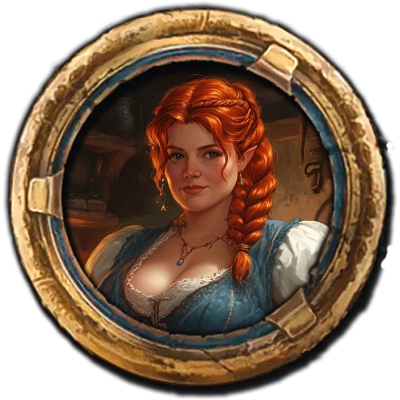

## Das schwarze Auge - 56. Runde der Kampagne: Greifenfurter Adel

Link, Gray und ich zogen uns zurück, um uns zu beraten. Die Andeutungen von Yorlak gaben uns zu denken. *Das Siegel, das er Link gezeigt hatte und sein Nachname... Barbrück, wie die Stadt, in der die Sharika ay Mada Basari ihren Hauptsitz hat.*

Wir waren uns sicher, dass es da eine Verbindung gibt. Yorlak war ganz klar ein Teil der Mada Basari und sein Name ließ vermuten, dass er vermutlich eine bedeutende Rolle in der aranischen Handelsgesellschaft spielen würde, welche eng mit der *Phexkirche* verbunden ist.

Doch wir wussten nicht viel über die Gesellschaft vom Mondkontor. Ursprünglich aus einer alten Handelskompanie hervorgegangen wird die Organisation heute von einem dreiköpfigen Gremium, dem Mondsilbernen Rat, bestehend aus Salamon ibn Dafar, Siminja al’Fenneqil *und einem geheimnisvollen dritten Mitglied*, geleitet. Unter dem Rat agieren die Mondsilberwesire, die eigenständig die einzelnen Handelsniederlassungen führen, während die einfachen Händler als Mondsilberhadjins bezeichnet werden.

Die wirtschaftliche Macht der Mada Basari beruht auf einem weitreichenden Handelsnetz. Mit der eigenen Kornflotte, die an der gesamten Ostküste im Einsatz ist, transportieren sie hauptsächlich Lebensmittel wie Getreide und Peraineäpfel, aber auch Handwerkswaren und nordländische Produkte. Zudem erstrecken sich ihre Besitzungen über weite Landflächen in Aranien. Doch seit dem Rückzug der Gründerin Sybia gibt es innere Spannungen, die zu unterschiedlichen Zielsetzungen innerhalb der Organisation geführt haben.

Uns war klar, dass es sicherlich noch einiges gab, was wir noch nicht über die Mada Basari wussten und noch einiges in Erfahrung zu bringen hatten. Doch dies mussten wir erst einmal vertagen. Es galt, unseren Weggefährten Boronep zu retten, daher begaben wir uns auf den Weg Richtung der Drachenei-Akademie.

Dort hatten Gray und ich in den letzten Tagen jede freie Stunde verbracht und gelernt. So erlangten wir das geheime Wissen, welches uns gegebenenfalls bei der Entschlüsselung der Schriftrollen helfen könnte. Vielleicht war dieses Wissen sogar eine Möglichkeit, Boronep zu helfen.

Unterwegs drehten sich unsere Gedanken um das Artefakt. Link, Gray und ich rätselten, was es wohl mit den *vier Kammern* auf sich hatte. Vermutlich würden sie etwas beinhalten, was zu den *vier Statuen in der Kammer unter der Höhle *passen könnte. Immerhin streckten diese die Hände aus, als ob man etwas hineinlegen sollte. Wenn wir nur den im Ur-Tulamydia verfassten Text lesen könnten.

Wir diskutierten lange. So lange, dass wir sogar eine ganze Weile vor der Akademie standen. Zwar außerhalb der üblichen Wege, um ungestört reden zu können, aber nicht unauffällig. Als drei geheimnistuerische Fremde nahe der magischen Fakultät zogen wir viel Aufmerksamkeit auf uns.

Um nicht noch weiter Verdacht zu erregen, betraten wir das Gebäude, um mit Ihrer Spektabilität Ashtarra Okharim zu sprechen. Boronep war noch immer tief in komplexe Rituale eingebunden, aber die Drachenei-Akademie zeigte sich zuversichtlich, dass bald greifbare Fortschritte erzielt würden. In 10 bis 15 Tagen, so versicherte uns die Spektabilität, könnten wir mit neuen Erkenntnissen rechnen. Wieder mussten wir uns in Geduld üben und darauf vertrauen, dass die Akademie tatsächlich alles unternahm, um unserem Freund zu helfen.

Wir waren hin- und hergerissen, ob wir dies alles abbrechen sollten, um Boronep auf den Weg zu schicken, oder ob wir die Akademie weiterarbeiten lassen sollten. Doch da wurden unsere Überlegungen von zwei Zwergen, einem Mann und einer Frau, unterbrochen, die sich lautstark mit dem niederen Verwaltung-Magier am Empfang unterhielten. Da dies in Tulamydia geschah verstanden wir kein Wort. Dennoch erkannten wir, dass sie unter großem Stress standen.

 

Auf Grund ihres Äußeren vermuteten wir, dass es sich bei den Beiden um Hügelzwerge handeln könnte und das die Chance bestand, dass sie vielleicht sogar Garethi sprechen konnten. Daher machte sich mein stets hilfsbereiter Freund Gray auf, um zu schauen, ob wir etwas für die Zwerge tun könnten und sprach die Frau an.

Die Zwölfe waren mit uns und den Beiden, denn auch sie beherrschten Garethi. So schilderten Thordra und Gundrabosch Eisenhammer uns, dass vor kurzem ein Fremder bei ihnen aufgetaucht war und darum bat, für ihn ein Schwert aus einem gar seltsamen Metall zu schmieden. Thordra war wohl von Anfang an dagegen aber die enorme Menge Gold die der in eine schwarze Kutte gekleidete Fremde bezahlen wollte, ließ Gundrabosch alle Bedenken in den Wind schlagen. Doch als sein Schmiedehammer das erste mal auf das seltsame Metall traf geschah Furchtbares. Die Esse, das Herzstück der Schmiede, explodierte förmlich und übel stinkender Rauch füllte den Raum. Dann erschienen grausame und verunstaltete Gestalten aus Erz. Sie entsprangen dem Schmiedefeuer und strömten in die Realität von Derre. Gundrabosch und Thordra gelang es gerade eben, sich zu retten und nun suchten sie Hilfe bei den Magiern. 

Das *verdorbene Erz* ließ uns aufhorchen, war es doch erst wenige Tage her, dass wir ein Unelementar des Humus in der Kanalisation besiegt hatten. Wir beschlossen dem Fall nachzugehen und zu schauen, ob wir vielleicht Anzeichen für einen Zusammenhang finden kon